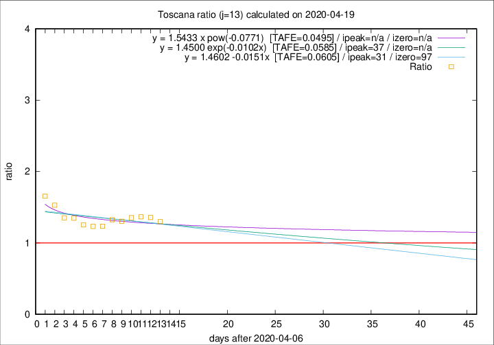

# Toscana

Data source: https://raw.githubusercontent.com/pcm-dpc/COVID-19/master/dati-json/dpc-covid19-ita-regioni.json

Delta days analysis (j): 13

Analyses for other values of j for 2020-04-19 are avalable [here](../2020-04-19/README.md)

Analyses for Toscana for previous dates are avalable [here](../README.md)

## Fitting 
|fit type|best fit equation|tafe|tfe|ipeak|izero|
|-------|-----|--------|------|---|---|
|linear|y = 1.4602 -0.0151x  [TAFE=0.0605]|0.0605|0.0049|31|97|
|exp|y = 1.4500 exp(-0.0102x)  [TAFE=0.0585]|0.0585|0.0024|37|n/a|
|pow|y = 1.5433 x pow(-0.0771)  [TAFE=0.0495]|0.0495|0.0016|n/a|n/a|

## Data
|Date|Daily deaths|Cumulated deaths|Deaths in the last 13 days|Deaths in the 13 days before|ratio|
|----|----------|-----------|-------|--------------------|-----|
|2020-04-19|19|637|287|221|1.2986|
|2020-04-18|16|618|293|216|1.3565|
|2020-04-17|17|602|295|216|1.3657|
|2020-04-16|29|585|295|218|1.3532|
|2020-04-15|18|556|288|221|1.3032|
|2020-04-14|20|538|285|215|1.3256|
|2020-04-13|23|518|274|222|1.2342|
|2020-04-12|28|495|264|214|1.2336|
|2020-04-11|13|467|252|201|1.2537|
|2020-04-10|46|454|256|190|1.3474|
|2020-04-09|16|408|231|171|1.3509|
|2020-04-08|23|392|234|153|1.5294|
|2020-04-07|19|369|227|137|1.6569|

[Download data as CSV](COVID-19_toscana_j13_2020-04-19.csv)

Generated April 19th, 2020 at 18:42:39 UTC+0200 with https://github.com/robianc/COVID-19
