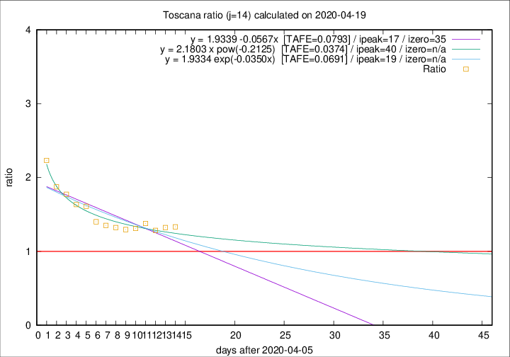

# Toscana

Data source: https://raw.githubusercontent.com/pcm-dpc/COVID-19/master/dati-json/dpc-covid19-ita-regioni.json

Delta days analysis (j): 14

Analyses for other values of j for 2020-04-19 are avalable [here](../2020-04-19/README.md)

Analyses for Toscana for previous dates are avalable [here](../README.md)

## Fitting 
|fit type|best fit equation|tafe|tfe|ipeak|izero|
|-------|-----|--------|------|---|---|
|linear|y = 1.9339 -0.0567x  [TAFE=0.0793]|0.0793|0.0069|17|35|
|exp|y = 1.9334 exp(-0.0350x)  [TAFE=0.0691]|0.0691|0.0033|19|n/a|
|pow|y = 2.1803 x pow(-0.2125)  [TAFE=0.0374]|0.0374|0.0010|40|n/a|

## Data
|Date|Daily deaths|Cumulated deaths|Deaths in the last 14 days|Deaths in the 14 days before|ratio|
|----|----------|-----------|-------|--------------------|-----|
|2020-04-19|19|637|312|234|1.3333|
|2020-04-18|16|618|311|235|1.3234|
|2020-04-17|17|602|312|243|1.2840|
|2020-04-16|29|585|317|230|1.3783|
|2020-04-15|18|556|303|231|1.3117|
|2020-04-14|20|538|294|227|1.2952|
|2020-04-13|23|518|287|217|1.3226|
|2020-04-12|28|495|280|207|1.3527|
|2020-04-11|13|467|269|192|1.4010|
|2020-04-10|46|454|277|172|1.6105|
|2020-04-09|16|408|250|153|1.6340|
|2020-04-08|23|392|250|141|1.7730|
|2020-04-07|19|369|240|128|1.8750|
|2020-04-06|25|350|241|108|2.2315|

[Download data as CSV](COVID-19_toscana_j14_2020-04-19.csv)

Generated April 19th, 2020 at 18:42:39 UTC+0200 with https://github.com/robianc/COVID-19
