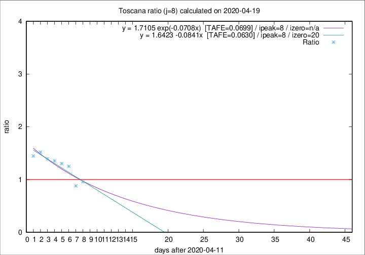

# Toscana

Data source: https://raw.githubusercontent.com/pcm-dpc/COVID-19/master/dati-json/dpc-covid19-ita-regioni.json

Delta days analysis (j): 8

Analyses for other values of j for 2020-04-19 are avalable [here](../2020-04-19/README.md)

Analyses for Toscana for previous dates are avalable [here](../README.md)

## Fitting 
|fit type|best fit equation|tafe|tfe|ipeak|izero|
|-------|-----|--------|------|---|---|
|linear|y = 1.6423 -0.0841x  [TAFE=0.0630]|0.0630|0.0075|8|20|
|exp|y = 1.7105 exp(-0.0708x)  [TAFE=0.0699]|0.0699|0.0038|8|n/a|

## Data
|Date|Daily deaths|Cumulated deaths|Deaths in the last 8 days|Deaths in the 8 days before|ratio|
|----|----------|-----------|-------|--------------------|-----|
|2020-04-19|19|637|170|177|0.9605|
|2020-04-18|16|618|164|186|0.8817|
|2020-04-17|17|602|194|155|1.2516|
|2020-04-16|29|585|193|148|1.3041|
|2020-04-15|18|556|187|138|1.3551|
|2020-04-14|20|538|188|135|1.3926|
|2020-04-13|23|518|193|127|1.5197|
|2020-04-12|28|495|188|130|1.4462|

[Download data as CSV](COVID-19_toscana_j8_2020-04-19.csv)

Generated April 19th, 2020 at 18:42:39 UTC+0200 with https://github.com/robianc/COVID-19
