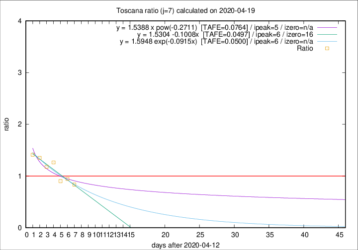

# Toscana

Data source: https://raw.githubusercontent.com/pcm-dpc/COVID-19/master/dati-json/dpc-covid19-ita-regioni.json

Estimates in this page were made on 19/4/2020 with data available until 19/04/2020.

## Summary 

### Peak estimate 
|j|linear [TAFE]|exponential [TAFE]|power law [TAFE]|details|
|---|----|-----------|---------|-------|
|7|19/4/2020 [TAFE=0.0497]|19/4/2020 [TAFE=0.0500]|18/4/2020 [TAFE=0.0764]|[analysis](COVID-19_toscana_j7_2020-04-19.md)|
|8|20/4/2020 [TAFE=0.0630]|20/4/2020 [TAFE=0.0699]|23/4/2020 [TAFE=0.1127]|[analysis](COVID-19_toscana_j8_2020-04-19.md)|
|9|24/4/2020 [TAFE=0.0714]|24/4/2020 [TAFE=0.0775]|29/5/2020 [TAFE=0.0887]|[analysis](COVID-19_toscana_j9_2020-04-19.md)|
|10|-|-|-|[analysis](COVID-19_toscana_j10_2020-04-19.md)|
|11|-|-|-|[analysis](COVID-19_toscana_j11_2020-04-19.md)|
|12|-|-|-|[analysis](COVID-19_toscana_j12_2020-04-19.md)|
|13|8/5/2020 [TAFE=0.0605]|14/5/2020 [TAFE=0.0585]|-|[analysis](COVID-19_toscana_j13_2020-04-19.md)|
|14|23/4/2020 [TAFE=0.0793]|25/4/2020 [TAFE=0.0691]|16/5/2020 [TAFE=0.0374]|[analysis](COVID-19_toscana_j14_2020-04-19.md)|

Best estimator is pow with j=14 (TAFE=0.0374)
Corresponding peak date estimate is 16/5/2020 (ipeak 40)

Peak date range estimate: 6/4/2020 - 24/5/2020

### End estimate 
|j|linear [TAFE/TFE]|exponential [TAFE/TFE]|power law [TAFE/TFE]|details|
|---|----|-----------|---------|-------|
|7|29/4/2020 [TAFE=0.0497]|-|-|[analysis](COVID-19_toscana_j7_2020-04-19.md)|
|8|-|-|-|[analysis](COVID-19_toscana_j8_2020-04-19.md)|
|9|-|-|-|[analysis](COVID-19_toscana_j9_2020-04-19.md)|
|10|-|-|-|[analysis](COVID-19_toscana_j10_2020-04-19.md)|
|11|-|-|-|[analysis](COVID-19_toscana_j11_2020-04-19.md)|
|12|-|-|-|[analysis](COVID-19_toscana_j12_2020-04-19.md)|
|13|-|-|-|[analysis](COVID-19_toscana_j13_2020-04-19.md)|
|14|-|-|-|[analysis](COVID-19_toscana_j14_2020-04-19.md)|

Best estimator is linear with j=7 (TAFE=0.0497)
Corresponding end date estimate is 29/4/2020 (izero 16)

End date range estimate: 13/4/2020 - 19/7/2020

Generated April 19th, 2020 at 18:42:39 UTC+0200 with https://github.com/robianc/COVID-19
