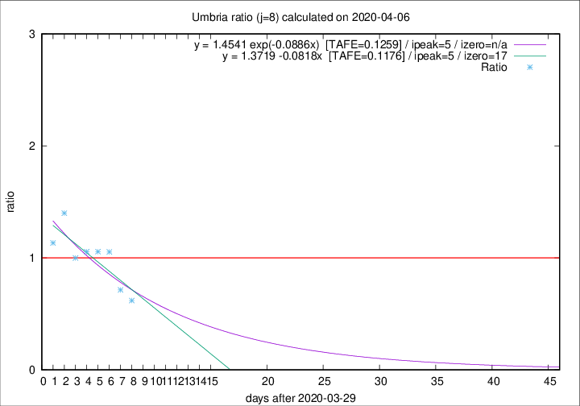

# Umbria

Data source: https://raw.githubusercontent.com/pcm-dpc/COVID-19/master/dati-json/dpc-covid19-ita-regioni.json

Delta days analysis (j): 8

Analyses for other values of j for 2020-04-06 are avalable [here](../README.md)

Analyses for Umbria for previous dates are avalable [here](../../README.md)

## Fitting 
|fit type|best fit equation|tafe|tfe|ipeak|izero|
|-------|-----|--------|------|---|---|
|linear|y = 1.3719 -0.0818x  [TAFE=0.1176]|0.1176|0.0181|5|17|
|exp|y = 1.4541 exp(-0.0886x)  [TAFE=0.1259]|0.1259|0.0091|5|n/a|

## Data
|Date|Daily deaths|Cumulated deaths|Deaths in the last 8 days|Deaths in the 8 days before|ratio|
|----|----------|-----------|-------|--------------------|-----|
|2020-04-06|1|44|13|21|0.6190|
|2020-04-05|2|43|15|21|0.7143|
|2020-04-04|2|41|20|19|1.0526|
|2020-04-03|1|39|19|18|1.0556|
|2020-04-02|1|38|19|18|1.0556|
|2020-04-01|0|37|18|18|1.0000|
|2020-03-31|4|37|21|15|1.4000|
|2020-03-30|2|33|17|15|1.1333|

[Download data as CSV](COVID-19_umbria_j8_2020-04-06.csv)

Generated April 10th, 2020 at 17:26:10 UTC+0200 with https://github.com/robianc/COVID-19
