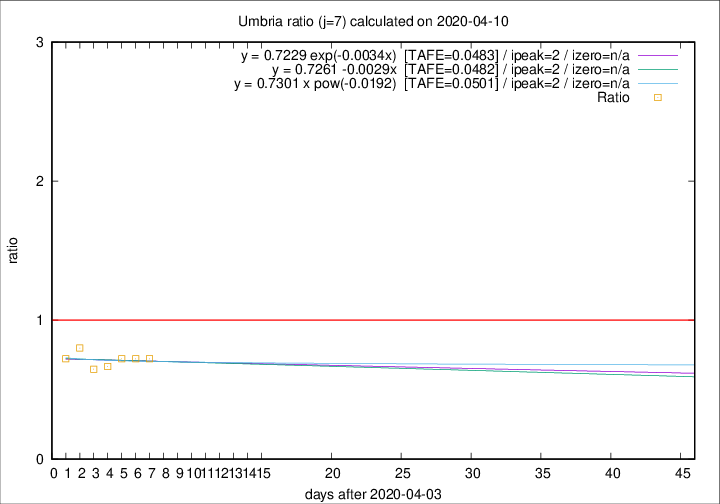

# Umbria

Data source: https://raw.githubusercontent.com/pcm-dpc/COVID-19/master/dati-json/dpc-covid19-ita-regioni.json

Delta days analysis (j): 7

Analyses for other values of j for 2020-04-10 are avalable [here](../2020-04-10/README.md)

Analyses for Umbria for previous dates are avalable [here](../README.md)

## Fitting 
|fit type|best fit equation|tafe|tfe|ipeak|izero|
|-------|-----|--------|------|---|---|
|linear|y = 0.7261 -0.0029x  [TAFE=0.0482]|0.0482|0.0037|2|n/a|
|exp|y = 0.7229 exp(-0.0034x)  [TAFE=0.0483]|0.0483|0.0018|2|n/a|
|pow|y = 0.7301 x pow(-0.0192)  [TAFE=0.0501]|0.0501|0.0019|2|n/a|

## Data
|Date|Daily deaths|Cumulated deaths|Deaths in the last 7 days|Deaths in the 7 days before|ratio|
|----|----------|-----------|-------|--------------------|-----|
|2020-04-10|1|52|13|18|0.7222|
|2020-04-09|1|51|13|18|0.7222|
|2020-04-08|1|50|13|18|0.7222|
|2020-04-07|5|49|12|18|0.6667|
|2020-04-06|1|44|11|17|0.6471|
|2020-04-05|2|43|12|15|0.8000|
|2020-04-04|2|41|13|18|0.7222|

[Download data as CSV](COVID-19_umbria_j7_2020-04-10.csv)

Generated April 19th, 2020 at 18:42:39 UTC+0200 with https://github.com/robianc/COVID-19
