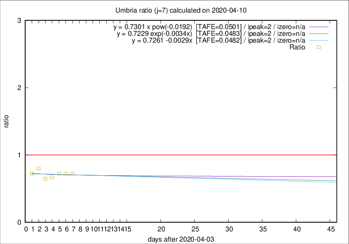
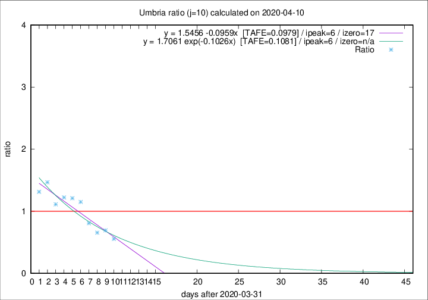

# Umbria

Data source: https://raw.githubusercontent.com/pcm-dpc/COVID-19/master/dati-json/dpc-covid19-ita-regioni.json

Estimates in this page were made on 16/4/2020 with data available until 10/04/2020.

## Summary 

### Peak estimate 
|j|linear [TAFE]|exponential [TAFE]|power law [TAFE]|details|
|---|----|-----------|---------|-------|
|7|6/4/2020 [TAFE=0.0482]|6/4/2020 [TAFE=0.0483]|6/4/2020 [TAFE=0.0501]|[analysis](COVID-19_umbria_j7_2020-04-10.md)|
|8|5/4/2020 [TAFE=0.1685]|5/4/2020 [TAFE=0.1648]|5/4/2020 [TAFE=0.1418]|[analysis](COVID-19_umbria_j8_2020-04-10.md)|
|9|6/4/2020 [TAFE=0.1196]|5/4/2020 [TAFE=0.1139]|5/4/2020 [TAFE=0.1252]|[analysis](COVID-19_umbria_j9_2020-04-10.md)|
|10|7/4/2020 [TAFE=0.0979]|7/4/2020 [TAFE=0.1081]|6/4/2020 [TAFE=0.1664]|[analysis](COVID-19_umbria_j10_2020-04-10.md)|
|11|9/4/2020 [TAFE=0.2949]|8/4/2020 [TAFE=0.1788]|8/4/2020 [TAFE=0.1573]|[analysis](COVID-19_umbria_j11_2020-04-10.md)|
|12|9/4/2020 [TAFE=1.5768]|9/4/2020 [TAFE=0.4437]|9/4/2020 [TAFE=0.2479]|[analysis](COVID-19_umbria_j12_2020-04-10.md)|
|13|9/4/2020 [TAFE=2.1301]|10/4/2020 [TAFE=0.5046]|12/4/2020 [TAFE=0.3659]|[analysis](COVID-19_umbria_j13_2020-04-10.md)|
|14|9/4/2020 [TAFE=1.5172]|11/4/2020 [TAFE=0.4514]|17/4/2020 [TAFE=0.5563]|[analysis](COVID-19_umbria_j14_2020-04-10.md)|

Best estimator is linear with j=7 (TAFE=0.0482)
Corresponding peak date estimate is 6/4/2020 (ipeak 2)

Peak date range estimate: 6/4/2020 - 24/4/2020

### End estimate 
|j|linear [TAFE/TFE]|exponential [TAFE/TFE]|power law [TAFE/TFE]|details|
|---|----|-----------|---------|-------|
|7|-|-|-|[analysis](COVID-19_umbria_j7_2020-04-10.md)|
|8|27/4/2020 [TAFE=0.1685]|-|-|[analysis](COVID-19_umbria_j8_2020-04-10.md)|
|9|21/4/2020 [TAFE=0.1196]|-|-|[analysis](COVID-19_umbria_j9_2020-04-10.md)|
|10|18/4/2020 [TAFE=0.0979]|-|-|[analysis](COVID-19_umbria_j10_2020-04-10.md)|
|11|-|-|-|[analysis](COVID-19_umbria_j11_2020-04-10.md)|
|12|-|-|-|[analysis](COVID-19_umbria_j12_2020-04-10.md)|
|13|-|-|-|[analysis](COVID-19_umbria_j13_2020-04-10.md)|
|14|-|-|-|[analysis](COVID-19_umbria_j14_2020-04-10.md)|

Best estimator is linear with j=10 (TAFE=0.0979)
Corresponding end date estimate is 18/4/2020 (izero 17)

End date range estimate: 1/4/2020 - 25/4/2020

Generated April 16th, 2020 at 20:09:19 UTC+0200 with https://github.com/robianc/COVID-19
