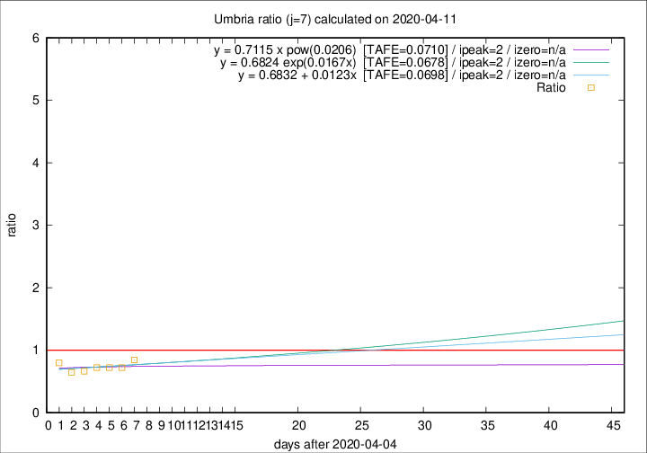

# Umbria

Data source: https://raw.githubusercontent.com/pcm-dpc/COVID-19/master/dati-json/dpc-covid19-ita-regioni.json

Estimates in this page were made on 14/4/2020 with data available until 11/04/2020.

## Summary 

### Peak estimate 
|j|linear [TAFE]|exponential [TAFE]|power law [TAFE]|details|
|---|----|-----------|---------|-------|
|7|7/4/2020 [TAFE=0.0698]|7/4/2020 [TAFE=0.0678]|7/4/2020 [TAFE=0.0710]|[analysis](COVID-19_umbria_j7_2020-04-11.md)|
|8|6/4/2020 [TAFE=0.1475]|6/4/2020 [TAFE=0.1425]|6/4/2020 [TAFE=0.1353]|[analysis](COVID-19_umbria_j8_2020-04-11.md)|
|9|6/4/2020 [TAFE=0.1398]|5/4/2020 [TAFE=0.1299]|5/4/2020 [TAFE=0.1108]|[analysis](COVID-19_umbria_j9_2020-04-11.md)|
|10|8/4/2020 [TAFE=0.1275]|7/4/2020 [TAFE=0.1172]|6/4/2020 [TAFE=0.1383]|[analysis](COVID-19_umbria_j10_2020-04-11.md)|
|11|9/4/2020 [TAFE=0.1516]|8/4/2020 [TAFE=0.1493]|7/4/2020 [TAFE=0.1661]|[analysis](COVID-19_umbria_j11_2020-04-11.md)|
|12|9/4/2020 [TAFE=1.3002]|10/4/2020 [TAFE=0.3312]|9/4/2020 [TAFE=0.2226]|[analysis](COVID-19_umbria_j12_2020-04-11.md)|
|13|9/4/2020 [TAFE=2.3132]|10/4/2020 [TAFE=0.5048]|11/4/2020 [TAFE=0.2641]|[analysis](COVID-19_umbria_j13_2020-04-11.md)|
|14|10/4/2020 [TAFE=2.0819]|11/4/2020 [TAFE=0.4512]|14/4/2020 [TAFE=0.4296]|[analysis](COVID-19_umbria_j14_2020-04-11.md)|

Best estimator is exp with j=7 (TAFE=0.0678)
Corresponding peak date estimate is 7/4/2020 (ipeak 2)

Peak date range estimate: 7/4/2020 - 21/4/2020

### End estimate 
|j|linear [TAFE/TFE]|exponential [TAFE/TFE]|power law [TAFE/TFE]|details|
|---|----|-----------|---------|-------|
|7|-|-|-|[analysis](COVID-19_umbria_j7_2020-04-11.md)|
|8|7/5/2020 [TAFE=0.1475]|-|-|[analysis](COVID-19_umbria_j8_2020-04-11.md)|
|9|23/4/2020 [TAFE=0.1398]|-|-|[analysis](COVID-19_umbria_j9_2020-04-11.md)|
|10|18/4/2020 [TAFE=0.1275]|-|-|[analysis](COVID-19_umbria_j10_2020-04-11.md)|
|11|-|-|-|[analysis](COVID-19_umbria_j11_2020-04-11.md)|
|12|-|-|-|[analysis](COVID-19_umbria_j12_2020-04-11.md)|
|13|-|-|-|[analysis](COVID-19_umbria_j13_2020-04-11.md)|
|14|-|-|-|[analysis](COVID-19_umbria_j14_2020-04-11.md)|

Best estimator is linear with j=10 (TAFE=0.1275)
Corresponding end date estimate is 18/4/2020 (izero 16)

End date range estimate: 2/4/2020 - 5/5/2020

Generated April 14th, 2020 at 19:16:04 UTC+0200 with https://github.com/robianc/COVID-19
