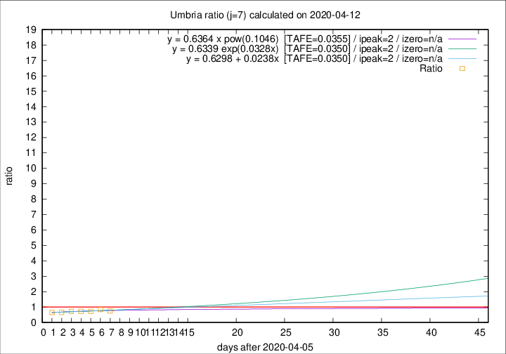

# Umbria

Data source: https://raw.githubusercontent.com/pcm-dpc/COVID-19/master/dati-json/dpc-covid19-ita-regioni.json

Delta days analysis (j): 7

Analyses for other values of j for 2020-04-12 are avalable [here](../README.md)

Analyses for Umbria for previous dates are avalable [here](../../README.md)

## Fitting 
|fit type|best fit equation|tafe|tfe|ipeak|izero|
|-------|-----|--------|------|---|---|
|linear|y = 0.6298 + 0.0238x  [TAFE=0.0350]|0.0350|0.0018|2|n/a|
|exp|y = 0.6339 exp(0.0328x)  [TAFE=0.0350]|0.0350|0.0009|2|n/a|
|pow|y = 0.6364 x pow(0.1046)  [TAFE=0.0355]|0.0355|0.0010|2|n/a|

## Data
|Date|Daily deaths|Cumulated deaths|Deaths in the last 7 days|Deaths in the 7 days before|ratio|
|----|----------|-----------|-------|--------------------|-----|
|2020-04-12|0|52|9|12|0.7500|
|2020-04-11|0|52|11|13|0.8462|
|2020-04-10|1|52|13|18|0.7222|
|2020-04-09|1|51|13|18|0.7222|
|2020-04-08|1|50|13|18|0.7222|
|2020-04-07|5|49|12|18|0.6667|
|2020-04-06|1|44|11|17|0.6471|

[Download data as CSV](COVID-19_umbria_j7_2020-04-12.csv)

Generated April 12th, 2020 at 16:28:18 UTC+0200 with https://github.com/robianc/COVID-19
