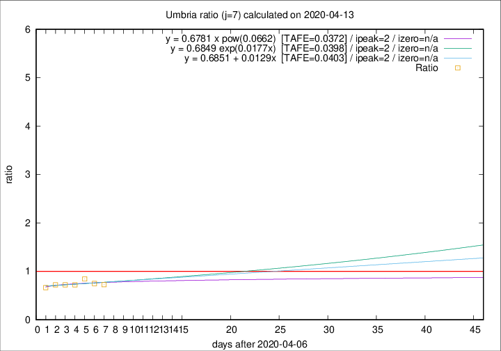

# Umbria

Data source: https://raw.githubusercontent.com/pcm-dpc/COVID-19/master/dati-json/dpc-covid19-ita-regioni.json

Estimates in this page were made on 14/4/2020 with data available until 13/04/2020.

## Summary 

### Peak estimate 
|j|linear [TAFE]|exponential [TAFE]|power law [TAFE]|details|
|---|----|-----------|---------|-------|
|7|9/4/2020 [TAFE=0.0403]|9/4/2020 [TAFE=0.0398]|9/4/2020 [TAFE=0.0372]|[analysis](COVID-19_umbria_j7_2020-04-13.md)|
|8|8/4/2020 [TAFE=0.1260]|8/4/2020 [TAFE=0.1265]|8/4/2020 [TAFE=0.1365]|[analysis](COVID-19_umbria_j8_2020-04-13.md)|
|9|7/4/2020 [TAFE=0.1262]|7/4/2020 [TAFE=0.1198]|7/4/2020 [TAFE=0.1119]|[analysis](COVID-19_umbria_j9_2020-04-13.md)|
|10|8/4/2020 [TAFE=0.1624]|7/4/2020 [TAFE=0.1389]|7/4/2020 [TAFE=0.1096]|[analysis](COVID-19_umbria_j10_2020-04-13.md)|
|11|9/4/2020 [TAFE=0.1595]|8/4/2020 [TAFE=0.1420]|7/4/2020 [TAFE=0.1743]|[analysis](COVID-19_umbria_j11_2020-04-13.md)|
|12|10/4/2020 [TAFE=0.1889]|9/4/2020 [TAFE=0.1623]|8/4/2020 [TAFE=0.2099]|[analysis](COVID-19_umbria_j12_2020-04-13.md)|
|13|11/4/2020 [TAFE=1.3134]|11/4/2020 [TAFE=0.2879]|10/4/2020 [TAFE=0.2341]|[analysis](COVID-19_umbria_j13_2020-04-13.md)|
|14|11/4/2020 [TAFE=2.6239]|12/4/2020 [TAFE=0.4599]|12/4/2020 [TAFE=0.2310]|[analysis](COVID-19_umbria_j14_2020-04-13.md)|

Best estimator is pow with j=7 (TAFE=0.0372)
Corresponding peak date estimate is 9/4/2020 (ipeak 2)

Peak date range estimate: 9/4/2020 - 19/4/2020

### End estimate 
|j|linear [TAFE/TFE]|exponential [TAFE/TFE]|power law [TAFE/TFE]|details|
|---|----|-----------|---------|-------|
|7|-|-|-|[analysis](COVID-19_umbria_j7_2020-04-13.md)|
|8|11/5/2020 [TAFE=0.1260]|-|-|[analysis](COVID-19_umbria_j8_2020-04-13.md)|
|9|-|-|-|[analysis](COVID-19_umbria_j9_2020-04-13.md)|
|10|-|-|-|[analysis](COVID-19_umbria_j10_2020-04-13.md)|
|11|-|-|-|[analysis](COVID-19_umbria_j11_2020-04-13.md)|
|12|-|-|-|[analysis](COVID-19_umbria_j12_2020-04-13.md)|
|13|-|-|-|[analysis](COVID-19_umbria_j13_2020-04-13.md)|
|14|-|-|-|[analysis](COVID-19_umbria_j14_2020-04-13.md)|

Best estimator is linear with j=8 (TAFE=0.1260)
Corresponding end date estimate is 11/5/2020 (izero 35)

End date range estimate: 6/4/2020 - 11/5/2020

Generated April 14th, 2020 at 19:16:04 UTC+0200 with https://github.com/robianc/COVID-19
