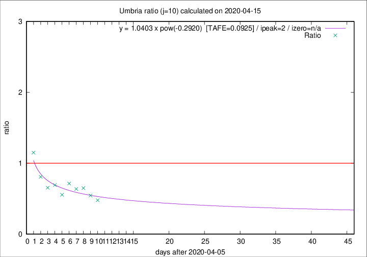

# Umbria

Data source: https://raw.githubusercontent.com/pcm-dpc/COVID-19/master/dati-json/dpc-covid19-ita-regioni.json

Delta days analysis (j): 10

Analyses for other values of j for 2020-04-15 are avalable [here](../2020-04-15/README.md)

Analyses for Umbria for previous dates are avalable [here](../README.md)

## Fitting 
|fit type|best fit equation|tafe|tfe|ipeak|izero|
|-------|-----|--------|------|---|---|
|pow|y = 1.0403 x pow(-0.2920)  [TAFE=0.0925]|0.0925|0.0057|2|n/a|

## Data
|Date|Daily deaths|Cumulated deaths|Deaths in the last 10 days|Deaths in the 10 days before|ratio|
|----|----------|-----------|-------|--------------------|-----|
|2020-04-15|1|54|11|23|0.4783|
|2020-04-14|1|53|12|22|0.5455|
|2020-04-13|0|52|13|20|0.6500|
|2020-04-12|0|52|14|22|0.6364|
|2020-04-11|0|52|15|21|0.7143|
|2020-04-10|1|52|15|27|0.5556|
|2020-04-09|1|51|18|26|0.6923|
|2020-04-08|1|50|19|29|0.6552|
|2020-04-07|5|49|21|26|0.8077|
|2020-04-06|1|44|23|20|1.1500|

[Download data as CSV](COVID-19_umbria_j10_2020-04-15.csv)

Generated April 19th, 2020 at 18:42:39 UTC+0200 with https://github.com/robianc/COVID-19
