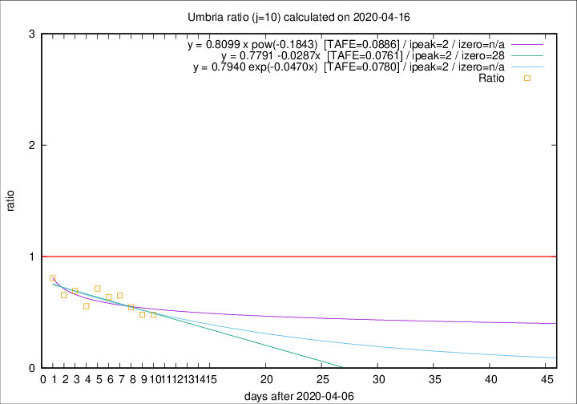

# Umbria

Data source: https://raw.githubusercontent.com/pcm-dpc/COVID-19/master/dati-json/dpc-covid19-ita-regioni.json

Delta days analysis (j): 10

Analyses for other values of j for 2020-04-16 are avalable [here](../2020-04-16/README.md)

Analyses for Umbria for previous dates are avalable [here](../README.md)

## Fitting 
|fit type|best fit equation|tafe|tfe|ipeak|izero|
|-------|-----|--------|------|---|---|
|linear|y = 0.7791 -0.0287x  [TAFE=0.0761]|0.0761|0.0086|2|28|
|exp|y = 0.7940 exp(-0.0470x)  [TAFE=0.0780]|0.0780|0.0045|2|n/a|
|pow|y = 0.8099 x pow(-0.1843)  [TAFE=0.0886]|0.0886|0.0053|2|n/a|

## Data
|Date|Daily deaths|Cumulated deaths|Deaths in the last 10 days|Deaths in the 10 days before|ratio|
|----|----------|-----------|-------|--------------------|-----|
|2020-04-16|1|55|11|23|0.4783|
|2020-04-15|1|54|11|23|0.4783|
|2020-04-14|1|53|12|22|0.5455|
|2020-04-13|0|52|13|20|0.6500|
|2020-04-12|0|52|14|22|0.6364|
|2020-04-11|0|52|15|21|0.7143|
|2020-04-10|1|52|15|27|0.5556|
|2020-04-09|1|51|18|26|0.6923|
|2020-04-08|1|50|19|29|0.6552|
|2020-04-07|5|49|21|26|0.8077|

[Download data as CSV](COVID-19_umbria_j10_2020-04-16.csv)

Generated April 16th, 2020 at 20:09:19 UTC+0200 with https://github.com/robianc/COVID-19
