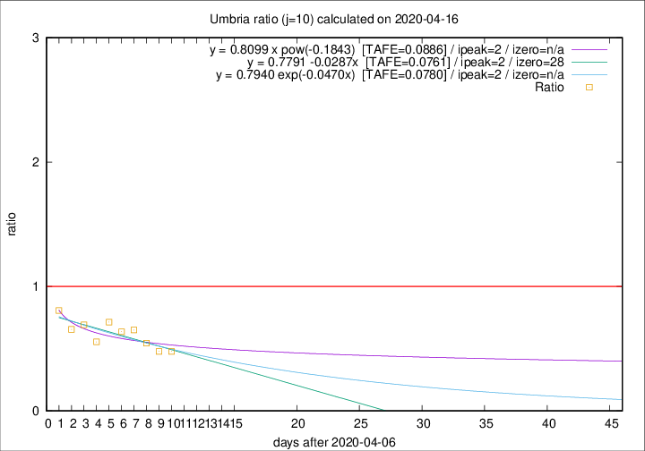

# Umbria

Data source: https://raw.githubusercontent.com/pcm-dpc/COVID-19/master/dati-json/dpc-covid19-ita-regioni.json

Estimates in this page were made on 16/4/2020 with data available until 16/04/2020.

## Summary 

### Peak estimate 
|j|linear [TAFE]|exponential [TAFE]|power law [TAFE]|details|
|---|----|-----------|---------|-------|
|7|12/4/2020 [TAFE=0.1930]|12/4/2020 [TAFE=0.1876]|12/4/2020 [TAFE=0.2627]|[analysis](COVID-19_umbria_j7_2020-04-16.md)|
|8|11/4/2020 [TAFE=0.1184]|11/4/2020 [TAFE=0.1240]|11/4/2020 [TAFE=0.1698]|[analysis](COVID-19_umbria_j8_2020-04-16.md)|
|9|10/4/2020 [TAFE=0.1267]|10/4/2020 [TAFE=0.1293]|10/4/2020 [TAFE=0.1607]|[analysis](COVID-19_umbria_j9_2020-04-16.md)|
|10|9/4/2020 [TAFE=0.0761]|9/4/2020 [TAFE=0.0780]|9/4/2020 [TAFE=0.0886]|[analysis](COVID-19_umbria_j10_2020-04-16.md)|
|11|9/4/2020 [TAFE=0.2286]|8/4/2020 [TAFE=0.1790]|9/4/2020 [TAFE=0.1216]|[analysis](COVID-19_umbria_j11_2020-04-16.md)|
|12|11/4/2020 [TAFE=0.2617]|10/4/2020 [TAFE=0.2089]|9/4/2020 [TAFE=0.2028]|[analysis](COVID-19_umbria_j12_2020-04-16.md)|
|13|12/4/2020 [TAFE=0.2308]|11/4/2020 [TAFE=0.1845]|9/4/2020 [TAFE=0.2342]|[analysis](COVID-19_umbria_j13_2020-04-16.md)|
|14|13/4/2020 [TAFE=0.3090]|12/4/2020 [TAFE=0.1670]|11/4/2020 [TAFE=0.2087]|[analysis](COVID-19_umbria_j14_2020-04-16.md)|

Best estimator is linear with j=10 (TAFE=0.0761)
Corresponding peak date estimate is 9/4/2020 (ipeak 2)

Peak date range estimate: 9/4/2020 - 17/4/2020

### End estimate 
|j|linear [TAFE/TFE]|exponential [TAFE/TFE]|power law [TAFE/TFE]|details|
|---|----|-----------|---------|-------|
|7|20/4/2020 [TAFE=0.1930]|-|-|[analysis](COVID-19_umbria_j7_2020-04-16.md)|
|8|24/4/2020 [TAFE=0.1184]|-|-|[analysis](COVID-19_umbria_j8_2020-04-16.md)|
|9|-|-|-|[analysis](COVID-19_umbria_j9_2020-04-16.md)|
|10|5/5/2020 [TAFE=0.0761]|-|-|[analysis](COVID-19_umbria_j10_2020-04-16.md)|
|11|-|-|-|[analysis](COVID-19_umbria_j11_2020-04-16.md)|
|12|-|-|-|[analysis](COVID-19_umbria_j12_2020-04-16.md)|
|13|-|-|-|[analysis](COVID-19_umbria_j13_2020-04-16.md)|
|14|-|-|-|[analysis](COVID-19_umbria_j14_2020-04-16.md)|

Best estimator is linear with j=10 (TAFE=0.0761)
Corresponding end date estimate is 5/5/2020 (izero 28)

End date range estimate: 7/4/2020 - 5/5/2020

Generated April 16th, 2020 at 20:09:19 UTC+0200 with https://github.com/robianc/COVID-19
