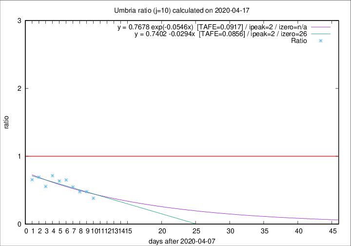

# Umbria

Data source: https://raw.githubusercontent.com/pcm-dpc/COVID-19/master/dati-json/dpc-covid19-ita-regioni.json

Estimates in this page were made on 19/4/2020 with data available until 17/04/2020.

## Summary 

### Peak estimate 
|j|linear [TAFE]|exponential [TAFE]|power law [TAFE]|details|
|---|----|-----------|---------|-------|
|7|13/4/2020 [TAFE=0.2367]|13/4/2020 [TAFE=0.2041]|13/4/2020 [TAFE=0.2011]|[analysis](COVID-19_umbria_j7_2020-04-17.md)|
|8|12/4/2020 [TAFE=0.1490]|12/4/2020 [TAFE=0.1427]|12/4/2020 [TAFE=0.1547]|[analysis](COVID-19_umbria_j8_2020-04-17.md)|
|9|11/4/2020 [TAFE=0.1256]|11/4/2020 [TAFE=0.1232]|11/4/2020 [TAFE=0.1556]|[analysis](COVID-19_umbria_j9_2020-04-17.md)|
|10|10/4/2020 [TAFE=0.0856]|10/4/2020 [TAFE=0.0917]|10/4/2020 [TAFE=0.1219]|[analysis](COVID-19_umbria_j10_2020-04-17.md)|
|11|9/4/2020 [TAFE=0.1875]|9/4/2020 [TAFE=0.1453]|9/4/2020 [TAFE=0.1200]|[analysis](COVID-19_umbria_j11_2020-04-17.md)|
|12|11/4/2020 [TAFE=0.3053]|10/4/2020 [TAFE=0.2357]|9/4/2020 [TAFE=0.1808]|[analysis](COVID-19_umbria_j12_2020-04-17.md)|
|13|12/4/2020 [TAFE=0.2762]|11/4/2020 [TAFE=0.2114]|10/4/2020 [TAFE=0.2273]|[analysis](COVID-19_umbria_j13_2020-04-17.md)|
|14|13/4/2020 [TAFE=0.2510]|12/4/2020 [TAFE=0.1758]|11/4/2020 [TAFE=0.2210]|[analysis](COVID-19_umbria_j14_2020-04-17.md)|

Best estimator is linear with j=10 (TAFE=0.0856)
Corresponding peak date estimate is 10/4/2020 (ipeak 2)

Peak date range estimate: 10/4/2020 - 17/4/2020

### End estimate 
|j|linear [TAFE/TFE]|exponential [TAFE/TFE]|power law [TAFE/TFE]|details|
|---|----|-----------|---------|-------|
|7|21/4/2020 [TAFE=0.2367]|-|-|[analysis](COVID-19_umbria_j7_2020-04-17.md)|
|8|26/4/2020 [TAFE=0.1490]|-|-|[analysis](COVID-19_umbria_j8_2020-04-17.md)|
|9|28/4/2020 [TAFE=0.1256]|-|-|[analysis](COVID-19_umbria_j9_2020-04-17.md)|
|10|4/5/2020 [TAFE=0.0856]|-|-|[analysis](COVID-19_umbria_j10_2020-04-17.md)|
|11|-|-|-|[analysis](COVID-19_umbria_j11_2020-04-17.md)|
|12|-|-|-|[analysis](COVID-19_umbria_j12_2020-04-17.md)|
|13|-|-|-|[analysis](COVID-19_umbria_j13_2020-04-17.md)|
|14|-|-|-|[analysis](COVID-19_umbria_j14_2020-04-17.md)|

Best estimator is linear with j=10 (TAFE=0.0856)
Corresponding end date estimate is 4/5/2020 (izero 26)

End date range estimate: 8/4/2020 - 4/5/2020

Generated April 19th, 2020 at 18:42:39 UTC+0200 with https://github.com/robianc/COVID-19
