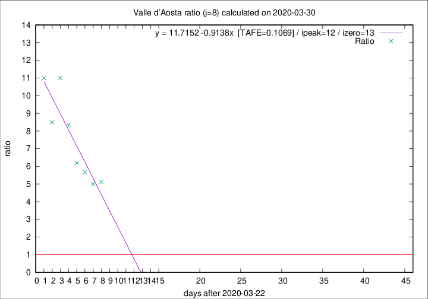

# Valle d'Aosta

Data source: https://raw.githubusercontent.com/pcm-dpc/COVID-19/master/dati-json/dpc-covid19-ita-regioni.json

Estimates in this page were made on 16/4/2020 with data available until 30/03/2020.

## Summary 

### Peak estimate 
|j|linear [TAFE]|exponential [TAFE]|power law [TAFE]|details|
|---|----|-----------|---------|-------|
|7|3/4/2020 [TAFE=0.1872]|9/4/2020 [TAFE=0.1381]|-|[analysis](COVID-19_valle_d'aosta_j7_2020-03-30.md)|
|8|4/4/2020 [TAFE=0.1069]|13/4/2020 [TAFE=0.0960]|-|[analysis](COVID-19_valle_d'aosta_j8_2020-03-30.md)|
|9|8/4/2020 [TAFE=0.2702]|22/4/2020 [TAFE=0.2647]|-|[analysis](COVID-19_valle_d'aosta_j9_2020-03-30.md)|
|10|13/6/2020 [TAFE=0.4584]|-|-|[analysis](COVID-19_valle_d'aosta_j10_2020-03-30.md)|
|11|-|-|-||
|12|-|-|-||
|13|-|-|-||
|14|-|-|-||

Best estimator is exp with j=8 (TAFE=0.0960)
Corresponding peak date estimate is 13/4/2020 (ipeak 21)

Peak date range estimate: 23/3/2020 - 15/6/2020

### End estimate 
|j|linear [TAFE/TFE]|exponential [TAFE/TFE]|power law [TAFE/TFE]|details|
|---|----|-----------|---------|-------|
|7|4/4/2020 [TAFE=0.1872]|-|-|[analysis](COVID-19_valle_d'aosta_j7_2020-03-30.md)|
|8|5/4/2020 [TAFE=0.1069]|-|-|[analysis](COVID-19_valle_d'aosta_j8_2020-03-30.md)|
|9|-|-|-|[analysis](COVID-19_valle_d'aosta_j9_2020-03-30.md)|
|10|-|-|-|[analysis](COVID-19_valle_d'aosta_j10_2020-03-30.md)|
|11|-|-|-||
|12|-|-|-||
|13|-|-|-||
|14|-|-|-||

Best estimator is linear with j=8 (TAFE=0.1069)
Corresponding end date estimate is 5/4/2020 (izero 13)

End date range estimate: 23/3/2020 - 22/6/2020

Generated April 16th, 2020 at 20:09:19 UTC+0200 with https://github.com/robianc/COVID-19
