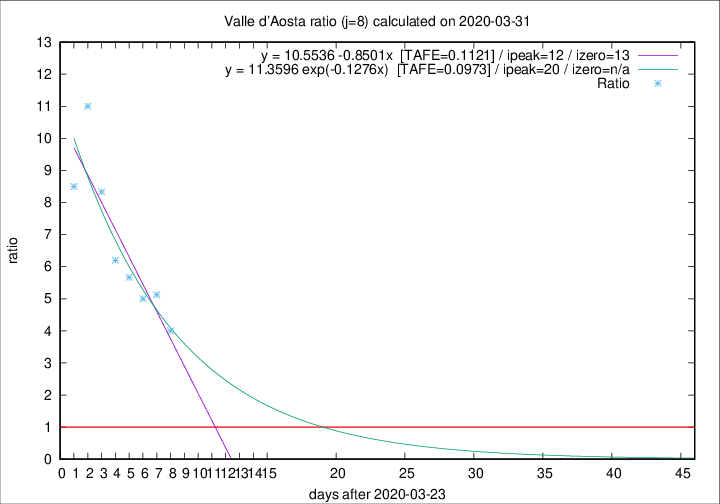

# Valle d'Aosta

Data source: https://raw.githubusercontent.com/pcm-dpc/COVID-19/master/dati-json/dpc-covid19-ita-regioni.json

Estimates in this page were made on 9/4/2020 with data available until 31/03/2020.

## Summary 

### Peak estimate 
|j|linear [TAFE]|exponential [TAFE]|power law [TAFE]|details|
|---|----|-----------|---------|-------|
|7|3/4/2020 [TAFE=0.1932]|7/4/2020 [TAFE=0.1932]|7/5/2020 [TAFE=0.1911]|[analysis](COVID-19_valle_d'aosta_j7_2020-03-31.md)|
|8|5/4/2020 [TAFE=0.1121]|13/4/2020 [TAFE=0.0973]|-|[analysis](COVID-19_valle_d'aosta_j8_2020-03-31.md)|
|9|5/4/2020 [TAFE=0.2072]|14/4/2020 [TAFE=0.1933]|-|[analysis](COVID-19_valle_d'aosta_j9_2020-03-31.md)|
|10|11/4/2020 [TAFE=0.3917]|29/4/2020 [TAFE=0.3716]|-|[analysis](COVID-19_valle_d'aosta_j10_2020-03-31.md)|
|11|-|-|-||
|12|-|-|-||
|13|-|-|-||
|14|-|-|-||

Best estimator is exp with j=8 (TAFE=0.0973)
Corresponding peak date estimate is 13/4/2020 (ipeak 20)

Peak date range estimate: 24/3/2020 - 6/5/2020

### End estimate 
|j|linear [TAFE/TFE]|exponential [TAFE/TFE]|power law [TAFE/TFE]|details|
|---|----|-----------|---------|-------|
|7|4/4/2020 [TAFE=0.1932]|-|-|[analysis](COVID-19_valle_d'aosta_j7_2020-03-31.md)|
|8|6/4/2020 [TAFE=0.1121]|-|-|[analysis](COVID-19_valle_d'aosta_j8_2020-03-31.md)|
|9|-|-|-|[analysis](COVID-19_valle_d'aosta_j9_2020-03-31.md)|
|10|-|-|-|[analysis](COVID-19_valle_d'aosta_j10_2020-03-31.md)|
|11|-|-|-||
|12|-|-|-||
|13|-|-|-||
|14|-|-|-||

Best estimator is linear with j=8 (TAFE=0.1121)
Corresponding end date estimate is 6/4/2020 (izero 13)

End date range estimate: 24/3/2020 - 15/4/2020

Generated April 9th, 2020 at 16:40:48 UTC+0200 with https://github.com/robianc/COVID-19
