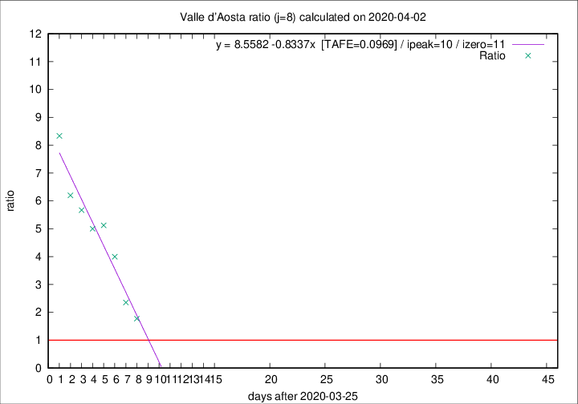

# Valle d'Aosta

Data source: https://raw.githubusercontent.com/pcm-dpc/COVID-19/master/dati-json/dpc-covid19-ita-regioni.json

Estimates in this page were made on 10/4/2020 with data available until 02/04/2020.

## Summary 

### Peak estimate 
|j|linear [TAFE]|exponential [TAFE]|power law [TAFE]|details|
|---|----|-----------|---------|-------|
|7|4/4/2020 [TAFE=0.1208]|5/4/2020 [TAFE=0.1135]|16/4/2020 [TAFE=0.2080]|[analysis](COVID-19_valle_d'aosta_j7_2020-04-02.md)|
|8|5/4/2020 [TAFE=0.0969]|7/4/2020 [TAFE=0.1296]|4/5/2020 [TAFE=0.2222]|[analysis](COVID-19_valle_d'aosta_j8_2020-04-02.md)|
|9|5/4/2020 [TAFE=0.1590]|10/4/2020 [TAFE=0.1864]|19/6/2020 [TAFE=0.2346]|[analysis](COVID-19_valle_d'aosta_j9_2020-04-02.md)|
|10|5/4/2020 [TAFE=0.2464]|12/4/2020 [TAFE=0.1920]|-|[analysis](COVID-19_valle_d'aosta_j10_2020-04-02.md)|
|11|8/4/2020 [TAFE=0.3061]|20/4/2020 [TAFE=0.3085]|-|[analysis](COVID-19_valle_d'aosta_j11_2020-04-02.md)|
|12|-|-|-||
|13|-|-|-||
|14|-|-|-||

Best estimator is linear with j=8 (TAFE=0.0969)
Corresponding peak date estimate is 5/4/2020 (ipeak 10)

Peak date range estimate: 26/3/2020 - 20/6/2020

### End estimate 
|j|linear [TAFE/TFE]|exponential [TAFE/TFE]|power law [TAFE/TFE]|details|
|---|----|-----------|---------|-------|
|7|6/4/2020 [TAFE=0.1208]|-|-|[analysis](COVID-19_valle_d'aosta_j7_2020-04-02.md)|
|8|6/4/2020 [TAFE=0.0969]|-|-|[analysis](COVID-19_valle_d'aosta_j8_2020-04-02.md)|
|9|-|-|-|[analysis](COVID-19_valle_d'aosta_j9_2020-04-02.md)|
|10|-|-|-|[analysis](COVID-19_valle_d'aosta_j10_2020-04-02.md)|
|11|-|-|-|[analysis](COVID-19_valle_d'aosta_j11_2020-04-02.md)|
|12|-|-|-||
|13|-|-|-||
|14|-|-|-||

Best estimator is linear with j=8 (TAFE=0.0969)
Corresponding end date estimate is 6/4/2020 (izero 11)

End date range estimate: 26/3/2020 - 11/4/2020

Generated April 10th, 2020 at 17:26:10 UTC+0200 with https://github.com/robianc/COVID-19
