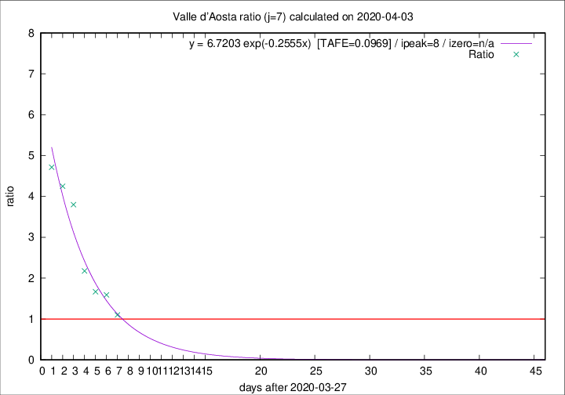

# Valle d'Aosta

Data source: https://raw.githubusercontent.com/pcm-dpc/COVID-19/master/dati-json/dpc-covid19-ita-regioni.json

Estimates in this page were made on 12/4/2020 with data available until 03/04/2020.

## Summary 

### Peak estimate 
|j|linear [TAFE]|exponential [TAFE]|power law [TAFE]|details|
|---|----|-----------|---------|-------|
|7|4/4/2020 [TAFE=0.1486]|5/4/2020 [TAFE=0.0969]|8/4/2020 [TAFE=0.1616]|[analysis](COVID-19_valle_d'aosta_j7_2020-04-03.md)|
|8|5/4/2020 [TAFE=0.1143]|7/4/2020 [TAFE=0.1270]|23/4/2020 [TAFE=0.2417]|[analysis](COVID-19_valle_d'aosta_j8_2020-04-03.md)|
|9|5/4/2020 [TAFE=0.1890]|9/4/2020 [TAFE=0.1651]|4/5/2020 [TAFE=0.2340]|[analysis](COVID-19_valle_d'aosta_j9_2020-04-03.md)|
|10|5/4/2020 [TAFE=0.2886]|11/4/2020 [TAFE=0.2041]|27/5/2020 [TAFE=0.2228]|[analysis](COVID-19_valle_d'aosta_j10_2020-04-03.md)|
|11|6/4/2020 [TAFE=0.2317]|14/4/2020 [TAFE=0.1885]|-|[analysis](COVID-19_valle_d'aosta_j11_2020-04-03.md)|
|12|10/4/2020 [TAFE=0.3862]|24/4/2020 [TAFE=0.3739]|-|[analysis](COVID-19_valle_d'aosta_j12_2020-04-03.md)|
|13|-|-|-||
|14|-|-|-||

Best estimator is exp with j=7 (TAFE=0.0969)
Corresponding peak date estimate is 5/4/2020 (ipeak 8)

Peak date range estimate: 28/3/2020 - 30/5/2020

### End estimate 
|j|linear [TAFE/TFE]|exponential [TAFE/TFE]|power law [TAFE/TFE]|details|
|---|----|-----------|---------|-------|
|7|6/4/2020 [TAFE=0.1486]|-|-|[analysis](COVID-19_valle_d'aosta_j7_2020-04-03.md)|
|8|7/4/2020 [TAFE=0.1143]|-|-|[analysis](COVID-19_valle_d'aosta_j8_2020-04-03.md)|
|9|-|-|-|[analysis](COVID-19_valle_d'aosta_j9_2020-04-03.md)|
|10|-|-|-|[analysis](COVID-19_valle_d'aosta_j10_2020-04-03.md)|
|11|-|-|-|[analysis](COVID-19_valle_d'aosta_j11_2020-04-03.md)|
|12|-|-|-|[analysis](COVID-19_valle_d'aosta_j12_2020-04-03.md)|
|13|-|-|-||
|14|-|-|-||

Best estimator is linear with j=8 (TAFE=0.1143)
Corresponding end date estimate is 7/4/2020 (izero 11)

End date range estimate: 27/3/2020 - 15/4/2020

Generated April 12th, 2020 at 17:02:01 UTC+0200 with https://github.com/robianc/COVID-19
