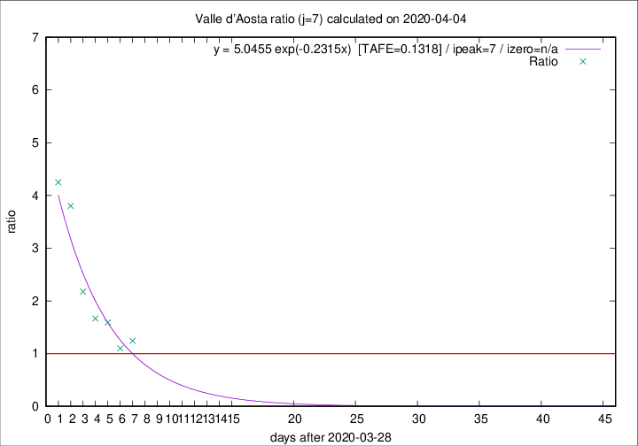

# Valle d'Aosta

Data source: https://raw.githubusercontent.com/pcm-dpc/COVID-19/master/dati-json/dpc-covid19-ita-regioni.json

Delta days analysis (j): 7

Analyses for other values of j for 2020-04-04 are avalable [here](../2020-04-04/README.md)

Analyses for Valle d'Aosta for previous dates are avalable [here](../README.md)

## Fitting 
|fit type|best fit equation|tafe|tfe|ipeak|izero|
|-------|-----|--------|------|---|---|
|exp|y = 5.0455 exp(-0.2315x)  [TAFE=0.1318]|0.1318|0.0111|7|n/a|

## Data
|Date|Daily deaths|Cumulated deaths|Deaths in the last 7 days|Deaths in the 7 days before|ratio|
|----|----------|-----------|-------|--------------------|-----|
|2020-04-04|12|82|41|33|1.2424|
|2020-04-03|7|70|33|30|1.1000|
|2020-04-02|4|63|35|22|1.5909|
|2020-04-01|3|59|35|21|1.6667|
|2020-03-31|6|56|37|17|2.1765|
|2020-03-30|7|50|38|10|3.8000|
|2020-03-29|2|43|34|8|4.2500|

[Download data as CSV](COVID-19_valle_d'aosta_j7_2020-04-04.csv)

Generated April 19th, 2020 at 18:42:39 UTC+0200 with https://github.com/robianc/COVID-19
