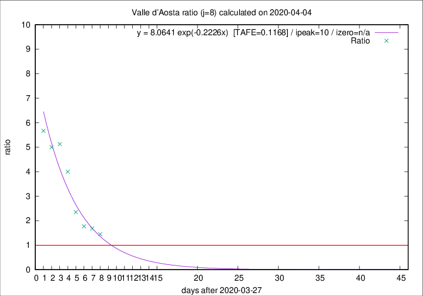

# Valle d'Aosta

Data source: https://raw.githubusercontent.com/pcm-dpc/COVID-19/master/dati-json/dpc-covid19-ita-regioni.json

Estimates in this page were made on 10/4/2020 with data available until 04/04/2020.

## Summary 

### Peak estimate 
|j|linear [TAFE]|exponential [TAFE]|power law [TAFE]|details|
|---|----|-----------|---------|-------|
|7|5/4/2020 [TAFE=0.2134]|5/4/2020 [TAFE=0.1318]|7/4/2020 [TAFE=0.1072]|[analysis](COVID-19_valle_d'aosta_j7_2020-04-04.md)|
|8|5/4/2020 [TAFE=0.1509]|7/4/2020 [TAFE=0.1168]|15/4/2020 [TAFE=0.1961]|[analysis](COVID-19_valle_d'aosta_j8_2020-04-04.md)|
|9|6/4/2020 [TAFE=0.1861]|9/4/2020 [TAFE=0.1697]|29/4/2020 [TAFE=0.2224]|[analysis](COVID-19_valle_d'aosta_j9_2020-04-04.md)|
|10|6/4/2020 [TAFE=0.2128]|11/4/2020 [TAFE=0.1971]|21/5/2020 [TAFE=0.2716]|[analysis](COVID-19_valle_d'aosta_j10_2020-04-04.md)|
|11|6/4/2020 [TAFE=0.2880]|12/4/2020 [TAFE=0.1565]|15/6/2020 [TAFE=0.2342]|[analysis](COVID-19_valle_d'aosta_j11_2020-04-04.md)|
|12|7/4/2020 [TAFE=0.2511]|18/4/2020 [TAFE=0.2451]|-|[analysis](COVID-19_valle_d'aosta_j12_2020-04-04.md)|
|13|-|-|-||
|14|-|-|-||

Best estimator is pow with j=7 (TAFE=0.1072)
Corresponding peak date estimate is 7/4/2020 (ipeak 9)

Peak date range estimate: 29/3/2020 - 19/6/2020

### End estimate 
|j|linear [TAFE/TFE]|exponential [TAFE/TFE]|power law [TAFE/TFE]|details|
|---|----|-----------|---------|-------|
|7|7/4/2020 [TAFE=0.2134]|-|-|[analysis](COVID-19_valle_d'aosta_j7_2020-04-04.md)|
|8|7/4/2020 [TAFE=0.1509]|-|-|[analysis](COVID-19_valle_d'aosta_j8_2020-04-04.md)|
|9|-|-|-|[analysis](COVID-19_valle_d'aosta_j9_2020-04-04.md)|
|10|-|-|-|[analysis](COVID-19_valle_d'aosta_j10_2020-04-04.md)|
|11|-|-|-|[analysis](COVID-19_valle_d'aosta_j11_2020-04-04.md)|
|12|-|-|-|[analysis](COVID-19_valle_d'aosta_j12_2020-04-04.md)|
|13|-|-|-||
|14|-|-|-||

Best estimator is linear with j=8 (TAFE=0.1509)
Corresponding end date estimate is 7/4/2020 (izero 10)

End date range estimate: 28/3/2020 - 12/4/2020

Generated April 10th, 2020 at 17:26:10 UTC+0200 with https://github.com/robianc/COVID-19
