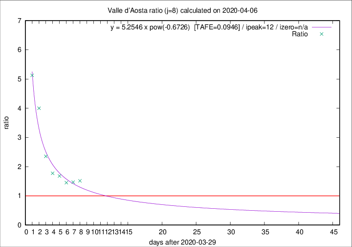

# Valle d'Aosta

Data source: https://raw.githubusercontent.com/pcm-dpc/COVID-19/master/dati-json/dpc-covid19-ita-regioni.json

Delta days analysis (j): 8

Analyses for other values of j for 2020-04-06 are avalable [here](../2020-04-06/README.md)

Analyses for Valle d'Aosta for previous dates are avalable [here](../README.md)

## Fitting 
|fit type|best fit equation|tafe|tfe|ipeak|izero|
|-------|-----|--------|------|---|---|
|pow|y = 5.2546 x pow(-0.6726)  [TAFE=0.0946]|0.0946|0.0061|12|n/a|

## Data
|Date|Daily deaths|Cumulated deaths|Deaths in the last 8 days|Deaths in the 8 days before|ratio|
|----|----------|-----------|-------|--------------------|-----|
|2020-04-06|5|96|53|35|1.5143|
|2020-04-05|9|91|50|34|1.4706|
|2020-04-04|12|82|45|31|1.4516|
|2020-04-03|7|70|42|25|1.6800|
|2020-04-02|4|63|39|22|1.7727|
|2020-04-01|3|59|40|17|2.3529|
|2020-03-31|6|56|44|11|4.0000|
|2020-03-30|7|50|41|8|5.1250|

[Download data as CSV](COVID-19_valle_d'aosta_j8_2020-04-06.csv)

Generated April 12th, 2020 at 17:02:01 UTC+0200 with https://github.com/robianc/COVID-19
