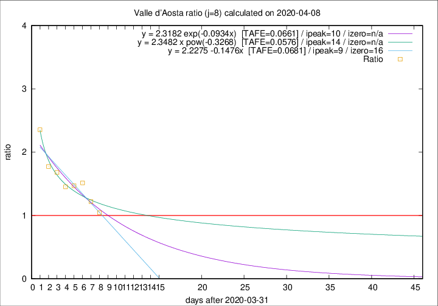

# Valle d'Aosta

Data source: https://raw.githubusercontent.com/pcm-dpc/COVID-19/master/dati-json/dpc-covid19-ita-regioni.json

Delta days analysis (j): 8

Analyses for other values of j for 2020-04-08 are avalable [here](../2020-04-08/README.md)

Analyses for Valle d'Aosta for previous dates are avalable [here](../README.md)

## Fitting 
|fit type|best fit equation|tafe|tfe|ipeak|izero|
|-------|-----|--------|------|---|---|
|linear|y = 2.2275 -0.1476x  [TAFE=0.0681]|0.0681|0.0055|9|16|
|exp|y = 2.3182 exp(-0.0934x)  [TAFE=0.0661]|0.0661|0.0032|10|n/a|
|pow|y = 2.3482 x pow(-0.3268)  [TAFE=0.0576]|0.0576|0.0029|14|n/a|

## Data
|Date|Daily deaths|Cumulated deaths|Deaths in the last 8 days|Deaths in the 8 days before|ratio|
|----|----------|-----------|-------|--------------------|-----|
|2020-04-08|2|102|46|44|1.0455|
|2020-04-07|4|100|50|41|1.2195|
|2020-04-06|5|96|53|35|1.5143|
|2020-04-05|9|91|50|34|1.4706|
|2020-04-04|12|82|45|31|1.4516|
|2020-04-03|7|70|42|25|1.6800|
|2020-04-02|4|63|39|22|1.7727|
|2020-04-01|3|59|40|17|2.3529|

[Download data as CSV](COVID-19_valle_d'aosta_j8_2020-04-08.csv)

Generated April 19th, 2020 at 18:42:39 UTC+0200 with https://github.com/robianc/COVID-19
