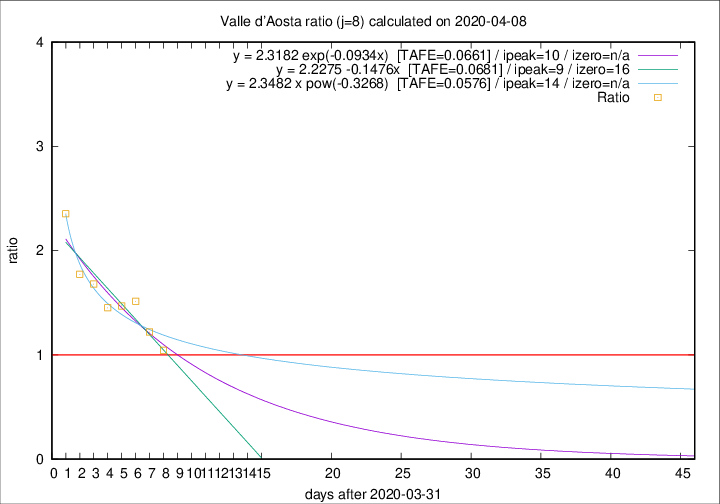

# Valle d'Aosta

Data source: https://raw.githubusercontent.com/pcm-dpc/COVID-19/master/dati-json/dpc-covid19-ita-regioni.json

Estimates in this page were made on 9/4/2020 with data available until 08/04/2020.

## Summary 

### Peak estimate 
|j|linear [TAFE]|exponential [TAFE]|power law [TAFE]|details|
|---|----|-----------|---------|-------|
|7|15/4/2020 [TAFE=0.0856]|17/4/2020 [TAFE=0.0835]|19/5/2020 [TAFE=0.0755]|[analysis](COVID-19_valle_d'aosta_j7_2020-04-08.md)|
|8|10/4/2020 [TAFE=0.0681]|11/4/2020 [TAFE=0.0661]|15/4/2020 [TAFE=0.0576]|[analysis](COVID-19_valle_d'aosta_j8_2020-04-08.md)|
|9|9/4/2020 [TAFE=0.2797]|10/4/2020 [TAFE=0.1589]|14/4/2020 [TAFE=0.0777]|[analysis](COVID-19_valle_d'aosta_j9_2020-04-08.md)|
|10|9/4/2020 [TAFE=0.2060]|11/4/2020 [TAFE=0.1336]|21/4/2020 [TAFE=0.1925]|[analysis](COVID-19_valle_d'aosta_j10_2020-04-08.md)|
|11|9/4/2020 [TAFE=0.1923]|12/4/2020 [TAFE=0.1080]|28/4/2020 [TAFE=0.2084]|[analysis](COVID-19_valle_d'aosta_j11_2020-04-08.md)|
|12|9/4/2020 [TAFE=0.3285]|13/4/2020 [TAFE=0.1318]|7/5/2020 [TAFE=0.2485]|[analysis](COVID-19_valle_d'aosta_j12_2020-04-08.md)|
|13|8/4/2020 [TAFE=0.5026]|14/4/2020 [TAFE=0.1534]|18/5/2020 [TAFE=0.2671]|[analysis](COVID-19_valle_d'aosta_j13_2020-04-08.md)|
|14|9/4/2020 [TAFE=0.3160]|17/4/2020 [TAFE=0.2337]|-|[analysis](COVID-19_valle_d'aosta_j14_2020-04-08.md)|

Best estimator is pow with j=8 (TAFE=0.0576)
Corresponding peak date estimate is 15/4/2020 (ipeak 14)

Peak date range estimate: 1/4/2020 - 23/5/2020

### End estimate 
|j|linear [TAFE/TFE]|exponential [TAFE/TFE]|power law [TAFE/TFE]|details|
|---|----|-----------|---------|-------|
|7|15/5/2020 [TAFE=0.0856]|-|-|[analysis](COVID-19_valle_d'aosta_j7_2020-04-08.md)|
|8|17/4/2020 [TAFE=0.0681]|-|-|[analysis](COVID-19_valle_d'aosta_j8_2020-04-08.md)|
|9|-|-|-|[analysis](COVID-19_valle_d'aosta_j9_2020-04-08.md)|
|10|-|-|-|[analysis](COVID-19_valle_d'aosta_j10_2020-04-08.md)|
|11|-|-|-|[analysis](COVID-19_valle_d'aosta_j11_2020-04-08.md)|
|12|-|-|-|[analysis](COVID-19_valle_d'aosta_j12_2020-04-08.md)|
|13|-|-|-|[analysis](COVID-19_valle_d'aosta_j13_2020-04-08.md)|
|14|-|-|-|[analysis](COVID-19_valle_d'aosta_j14_2020-04-08.md)|

Best estimator is linear with j=8 (TAFE=0.0681)
Corresponding end date estimate is 17/4/2020 (izero 16)

End date range estimate: 1/4/2020 - 14/5/2020

Generated April 9th, 2020 at 16:40:48 UTC+0200 with https://github.com/robianc/COVID-19
