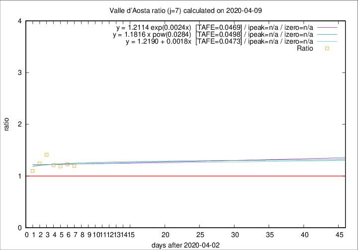

# Valle d'Aosta

Data source: https://raw.githubusercontent.com/pcm-dpc/COVID-19/master/dati-json/dpc-covid19-ita-regioni.json

Delta days analysis (j): 7

Analyses for other values of j for 2020-04-09 are avalable [here](../2020-04-09/README.md)

Analyses for Valle d'Aosta for previous dates are avalable [here](../README.md)

## Fitting 
|fit type|best fit equation|tafe|tfe|ipeak|izero|
|-------|-----|--------|------|---|---|
|linear|y = 1.2190 + 0.0018x  [TAFE=0.0473]|0.0473|0.0049|n/a|n/a|
|exp|y = 1.2114 exp(0.0024x)  [TAFE=0.0469]|0.0469|0.0023|n/a|n/a|
|pow|y = 1.1816 x pow(0.0284)  [TAFE=0.0498]|0.0498|0.0022|n/a|n/a|

## Data
|Date|Daily deaths|Cumulated deaths|Deaths in the last 7 days|Deaths in the 7 days before|ratio|
|----|----------|-----------|-------|--------------------|-----|
|2020-04-09|3|105|42|35|1.2000|
|2020-04-08|2|102|43|35|1.2286|
|2020-04-07|4|100|44|37|1.1892|
|2020-04-06|5|96|46|38|1.2105|
|2020-04-05|9|91|48|34|1.4118|
|2020-04-04|12|82|41|33|1.2424|
|2020-04-03|7|70|33|30|1.1000|

[Download data as CSV](COVID-19_valle_d'aosta_j7_2020-04-09.csv)

Generated April 12th, 2020 at 17:02:01 UTC+0200 with https://github.com/robianc/COVID-19
