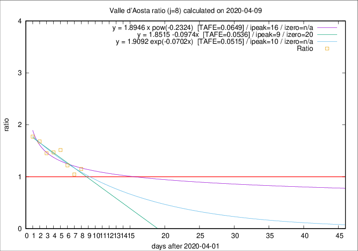

# Valle d'Aosta

Data source: https://raw.githubusercontent.com/pcm-dpc/COVID-19/master/dati-json/dpc-covid19-ita-regioni.json

Estimates in this page were made on 9/4/2020 with data available until 09/04/2020.

## Summary 

### Peak estimate 
|j|linear [TAFE]|exponential [TAFE]|power law [TAFE]|details|
|---|----|-----------|---------|-------|
|7|-|-|-|[analysis](COVID-19_valle_d'aosta_j7_2020-04-09.md)|
|8|11/4/2020 [TAFE=0.0536]|12/4/2020 [TAFE=0.0515]|18/4/2020 [TAFE=0.0649]|[analysis](COVID-19_valle_d'aosta_j8_2020-04-09.md)|
|9|10/4/2020 [TAFE=0.1776]|11/4/2020 [TAFE=0.1002]|14/4/2020 [TAFE=0.0797]|[analysis](COVID-19_valle_d'aosta_j9_2020-04-09.md)|
|10|10/4/2020 [TAFE=0.2734]|11/4/2020 [TAFE=0.1247]|16/4/2020 [TAFE=0.1213]|[analysis](COVID-19_valle_d'aosta_j10_2020-04-09.md)|
|11|10/4/2020 [TAFE=0.1449]|13/4/2020 [TAFE=0.1023]|28/4/2020 [TAFE=0.2339]|[analysis](COVID-19_valle_d'aosta_j11_2020-04-09.md)|
|12|9/4/2020 [TAFE=0.3606]|13/4/2020 [TAFE=0.1259]|28/4/2020 [TAFE=0.2148]|[analysis](COVID-19_valle_d'aosta_j12_2020-04-09.md)|
|13|9/4/2020 [TAFE=0.5527]|14/4/2020 [TAFE=0.1592]|5/5/2020 [TAFE=0.2589]|[analysis](COVID-19_valle_d'aosta_j13_2020-04-09.md)|
|14|9/4/2020 [TAFE=0.4452]|16/4/2020 [TAFE=0.1687]|31/5/2020 [TAFE=0.3536]|[analysis](COVID-19_valle_d'aosta_j14_2020-04-09.md)|

Best estimator is exp with j=8 (TAFE=0.0515)
Corresponding peak date estimate is 12/4/2020 (ipeak 10)

Peak date range estimate: 2/4/2020 - 6/6/2020

### End estimate 
|j|linear [TAFE/TFE]|exponential [TAFE/TFE]|power law [TAFE/TFE]|details|
|---|----|-----------|---------|-------|
|7|-|-|-|[analysis](COVID-19_valle_d'aosta_j7_2020-04-09.md)|
|8|22/4/2020 [TAFE=0.0536]|-|-|[analysis](COVID-19_valle_d'aosta_j8_2020-04-09.md)|
|9|-|-|-|[analysis](COVID-19_valle_d'aosta_j9_2020-04-09.md)|
|10|-|-|-|[analysis](COVID-19_valle_d'aosta_j10_2020-04-09.md)|
|11|-|-|-|[analysis](COVID-19_valle_d'aosta_j11_2020-04-09.md)|
|12|-|-|-|[analysis](COVID-19_valle_d'aosta_j12_2020-04-09.md)|
|13|-|-|-|[analysis](COVID-19_valle_d'aosta_j13_2020-04-09.md)|
|14|-|-|-|[analysis](COVID-19_valle_d'aosta_j14_2020-04-09.md)|

Best estimator is linear with j=8 (TAFE=0.0536)
Corresponding end date estimate is 22/4/2020 (izero 20)

End date range estimate: 2/4/2020 - 22/4/2020

Generated April 9th, 2020 at 16:40:48 UTC+0200 with https://github.com/robianc/COVID-19
