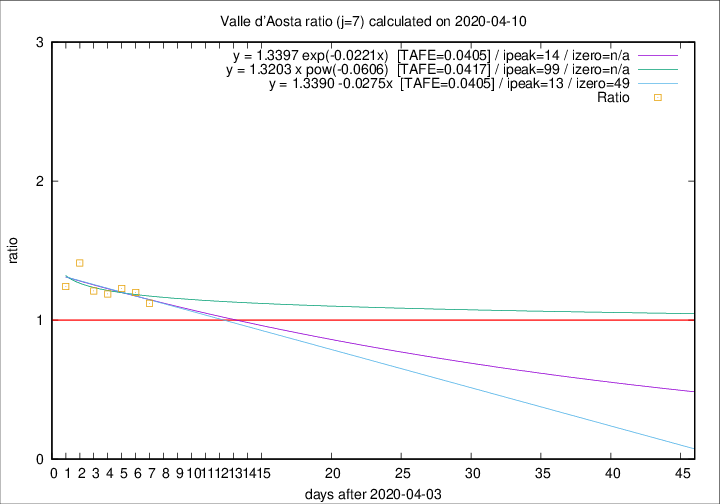

# Valle d'Aosta

Data source: https://raw.githubusercontent.com/pcm-dpc/COVID-19/master/dati-json/dpc-covid19-ita-regioni.json

Estimates in this page were made on 14/4/2020 with data available until 10/04/2020.

## Summary 

### Peak estimate 
|j|linear [TAFE]|exponential [TAFE]|power law [TAFE]|details|
|---|----|-----------|---------|-------|
|7|17/4/2020 [TAFE=0.0405]|18/4/2020 [TAFE=0.0405]|12/7/2020 [TAFE=0.0417]|[analysis](COVID-19_valle_d'aosta_j7_2020-04-10.md)|
|8|12/4/2020 [TAFE=0.0635]|12/4/2020 [TAFE=0.0601]|17/4/2020 [TAFE=0.0552]|[analysis](COVID-19_valle_d'aosta_j8_2020-04-10.md)|
|9|11/4/2020 [TAFE=0.0623]|12/4/2020 [TAFE=0.0482]|15/4/2020 [TAFE=0.0888]|[analysis](COVID-19_valle_d'aosta_j9_2020-04-10.md)|
|10|10/4/2020 [TAFE=0.2787]|11/4/2020 [TAFE=0.1236]|14/4/2020 [TAFE=0.0839]|[analysis](COVID-19_valle_d'aosta_j10_2020-04-10.md)|
|11|11/4/2020 [TAFE=0.2135]|12/4/2020 [TAFE=0.0975]|21/4/2020 [TAFE=0.2071]|[analysis](COVID-19_valle_d'aosta_j11_2020-04-10.md)|
|12|10/4/2020 [TAFE=0.2641]|13/4/2020 [TAFE=0.1210]|26/4/2020 [TAFE=0.2235]|[analysis](COVID-19_valle_d'aosta_j12_2020-04-10.md)|
|13|10/4/2020 [TAFE=0.4128]|14/4/2020 [TAFE=0.1414]|3/5/2020 [TAFE=0.3047]|[analysis](COVID-19_valle_d'aosta_j13_2020-04-10.md)|
|14|10/4/2020 [TAFE=0.6064]|15/4/2020 [TAFE=0.1488]|11/5/2020 [TAFE=0.3322]|[analysis](COVID-19_valle_d'aosta_j14_2020-04-10.md)|

Best estimator is linear with j=7 (TAFE=0.0405)
Corresponding peak date estimate is 17/4/2020 (ipeak 13)

Peak date range estimate: 13/4/2020 - 12/7/2020

### End estimate 
|j|linear [TAFE/TFE]|exponential [TAFE/TFE]|power law [TAFE/TFE]|details|
|---|----|-----------|---------|-------|
|7|23/5/2020 [TAFE=0.0405]|-|-|[analysis](COVID-19_valle_d'aosta_j7_2020-04-10.md)|
|8|-|-|-|[analysis](COVID-19_valle_d'aosta_j8_2020-04-10.md)|
|9|-|-|-|[analysis](COVID-19_valle_d'aosta_j9_2020-04-10.md)|
|10|-|-|-|[analysis](COVID-19_valle_d'aosta_j10_2020-04-10.md)|
|11|-|-|-|[analysis](COVID-19_valle_d'aosta_j11_2020-04-10.md)|
|12|-|-|-|[analysis](COVID-19_valle_d'aosta_j12_2020-04-10.md)|
|13|-|-|-|[analysis](COVID-19_valle_d'aosta_j13_2020-04-10.md)|
|14|-|-|-|[analysis](COVID-19_valle_d'aosta_j14_2020-04-10.md)|

Best estimator is linear with j=7 (TAFE=0.0405)
Corresponding end date estimate is 23/5/2020 (izero 49)

End date range estimate: 4/4/2020 - 23/5/2020

Generated April 14th, 2020 at 19:16:04 UTC+0200 with https://github.com/robianc/COVID-19
