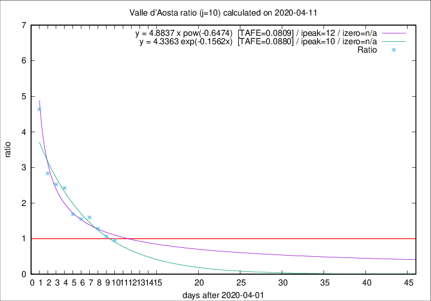

# Valle d'Aosta

Data source: https://raw.githubusercontent.com/pcm-dpc/COVID-19/master/dati-json/dpc-covid19-ita-regioni.json

Delta days analysis (j): 10

Analyses for other values of j for 2020-04-11 are avalable [here](../README.md)

Analyses for Valle d'Aosta for previous dates are avalable [here](../../README.md)

## Fitting 
|fit type|best fit equation|tafe|tfe|ipeak|izero|
|-------|-----|--------|------|---|---|
|exp|y = 4.3363 exp(-0.1562x)  [TAFE=0.0880]|0.0880|0.0057|10|n/a|
|pow|y = 4.8837 x pow(-0.6474)  [TAFE=0.0809]|0.0809|0.0051|12|n/a|

## Data
|Date|Daily deaths|Cumulated deaths|Deaths in the last 10 days|Deaths in the 10 days before|ratio|
|----|----------|-----------|-------|--------------------|-----|
|2020-04-11|0|107|48|50|0.9600|
|2020-04-10|2|107|51|48|1.0625|
|2020-04-09|3|105|55|43|1.2791|
|2020-04-08|2|102|59|37|1.5946|
|2020-04-07|4|100|59|38|1.5526|
|2020-04-06|5|96|59|35|1.6857|
|2020-04-05|9|91|63|26|2.4231|
|2020-04-04|12|82|58|23|2.5217|
|2020-04-03|7|70|51|18|2.8333|
|2020-04-02|4|63|51|11|4.6364|

[Download data as CSV](COVID-19_valle_d'aosta_j10_2020-04-11.csv)

Generated April 12th, 2020 at 16:28:18 UTC+0200 with https://github.com/robianc/COVID-19
