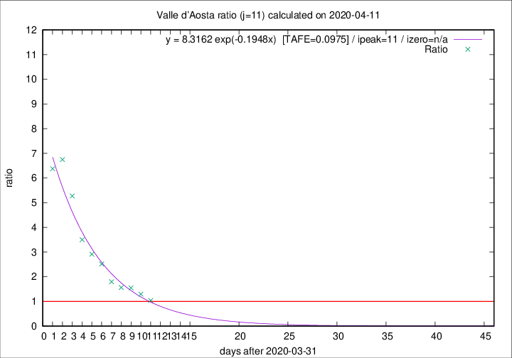

# Valle d'Aosta

Data source: https://raw.githubusercontent.com/pcm-dpc/COVID-19/master/dati-json/dpc-covid19-ita-regioni.json

Delta days analysis (j): 11

Analyses for other values of j for 2020-04-11 are avalable [here](../2020-04-11/README.md)

Analyses for Valle d'Aosta for previous dates are avalable [here](../README.md)

## Fitting 
|fit type|best fit equation|tafe|tfe|ipeak|izero|
|-------|-----|--------|------|---|---|
|exp|y = 8.3162 exp(-0.1948x)  [TAFE=0.0975]|0.0975|0.0058|11|n/a|

## Data
|Date|Daily deaths|Cumulated deaths|Deaths in the last 11 days|Deaths in the 11 days before|ratio|
|----|----------|-----------|-------|--------------------|-----|
|2020-04-11|0|107|51|49|1.0408|
|2020-04-10|2|107|57|44|1.2955|
|2020-04-09|3|105|62|40|1.5500|
|2020-04-08|2|102|61|39|1.5641|
|2020-04-07|4|100|63|35|1.8000|
|2020-04-06|5|96|68|27|2.5185|
|2020-04-05|9|91|67|23|2.9130|
|2020-04-04|12|82|63|18|3.5000|
|2020-04-03|7|70|58|11|5.2727|
|2020-04-02|4|63|54|8|6.7500|
|2020-04-01|3|59|51|8|6.3750|

[Download data as CSV](COVID-19_valle_d'aosta_j11_2020-04-11.csv)

Generated April 19th, 2020 at 18:42:39 UTC+0200 with https://github.com/robianc/COVID-19
