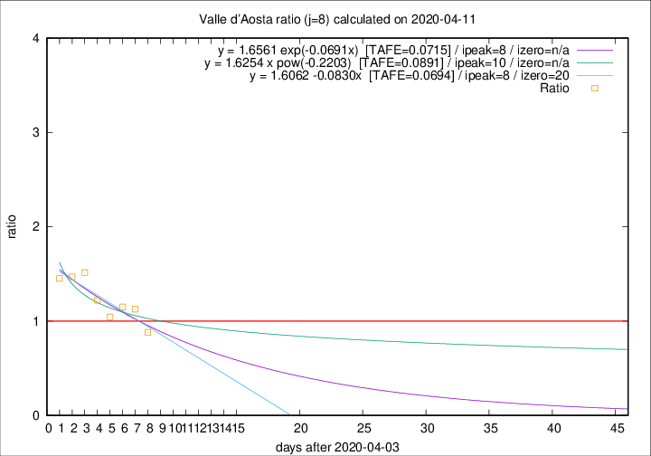

# Valle d'Aosta

Data source: https://raw.githubusercontent.com/pcm-dpc/COVID-19/master/dati-json/dpc-covid19-ita-regioni.json

Delta days analysis (j): 8

Analyses for other values of j for 2020-04-11 are avalable [here](../2020-04-11/README.md)

Analyses for Valle d'Aosta for previous dates are avalable [here](../README.md)

## Fitting 
|fit type|best fit equation|tafe|tfe|ipeak|izero|
|-------|-----|--------|------|---|---|
|linear|y = 1.6062 -0.0830x  [TAFE=0.0694]|0.0694|0.0064|8|20|
|exp|y = 1.6561 exp(-0.0691x)  [TAFE=0.0715]|0.0715|0.0030|8|n/a|
|pow|y = 1.6254 x pow(-0.2203)  [TAFE=0.0891]|0.0891|0.0052|10|n/a|

## Data
|Date|Daily deaths|Cumulated deaths|Deaths in the last 8 days|Deaths in the 8 days before|ratio|
|----|----------|-----------|-------|--------------------|-----|
|2020-04-11|0|107|37|42|0.8810|
|2020-04-10|2|107|44|39|1.1282|
|2020-04-09|3|105|46|40|1.1500|
|2020-04-08|2|102|46|44|1.0455|
|2020-04-07|4|100|50|41|1.2195|
|2020-04-06|5|96|53|35|1.5143|
|2020-04-05|9|91|50|34|1.4706|
|2020-04-04|12|82|45|31|1.4516|

[Download data as CSV](COVID-19_valle_d'aosta_j8_2020-04-11.csv)

Generated April 16th, 2020 at 20:09:19 UTC+0200 with https://github.com/robianc/COVID-19
