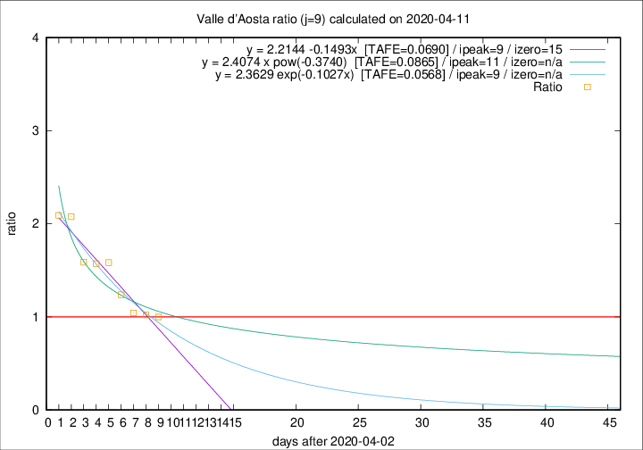

# Valle d'Aosta

Data source: https://raw.githubusercontent.com/pcm-dpc/COVID-19/master/dati-json/dpc-covid19-ita-regioni.json

Delta days analysis (j): 9

Analyses for other values of j for 2020-04-11 are avalable [here](../2020-04-11/README.md)

Analyses for Valle d'Aosta for previous dates are avalable [here](../README.md)

## Fitting 
|fit type|best fit equation|tafe|tfe|ipeak|izero|
|-------|-----|--------|------|---|---|
|linear|y = 2.2144 -0.1493x  [TAFE=0.0690]|0.0690|0.0038|9|15|
|exp|y = 2.3629 exp(-0.1027x)  [TAFE=0.0568]|0.0568|0.0022|9|n/a|
|pow|y = 2.4074 x pow(-0.3740)  [TAFE=0.0865]|0.0865|0.0053|11|n/a|

## Data
|Date|Daily deaths|Cumulated deaths|Deaths in the last 9 days|Deaths in the 9 days before|ratio|
|----|----------|-----------|-------|--------------------|-----|
|2020-04-11|0|107|44|44|1.0000|
|2020-04-10|2|107|48|47|1.0213|
|2020-04-09|3|105|49|47|1.0426|
|2020-04-08|2|102|52|42|1.2381|
|2020-04-07|4|100|57|36|1.5833|
|2020-04-06|5|96|55|35|1.5714|
|2020-04-05|9|91|54|34|1.5882|
|2020-04-04|12|82|54|26|2.0769|
|2020-04-03|7|70|46|22|2.0909|

[Download data as CSV](COVID-19_valle_d'aosta_j9_2020-04-11.csv)

Generated April 12th, 2020 at 17:02:01 UTC+0200 with https://github.com/robianc/COVID-19
