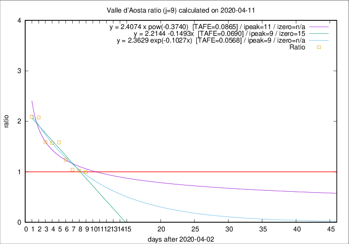

# Valle d'Aosta

Data source: https://raw.githubusercontent.com/pcm-dpc/COVID-19/master/dati-json/dpc-covid19-ita-regioni.json

Estimates in this page were made on 12/4/2020 with data available until 11/04/2020.

## Summary 

### Peak estimate 
|j|linear [TAFE]|exponential [TAFE]|power law [TAFE]|details|
|---|----|-----------|---------|-------|
|7|11/4/2020 [TAFE=0.1277]|11/4/2020 [TAFE=0.1404]|11/4/2020 [TAFE=0.1599]|[analysis](COVID-19_valle_d'aosta_j7_2020-04-11.md)|
|8|12/4/2020 [TAFE=0.0694]|12/4/2020 [TAFE=0.0715]|14/4/2020 [TAFE=0.0891]|[analysis](COVID-19_valle_d'aosta_j8_2020-04-11.md)|
|9|12/4/2020 [TAFE=0.0690]|12/4/2020 [TAFE=0.0568]|14/4/2020 [TAFE=0.0865]|[analysis](COVID-19_valle_d'aosta_j9_2020-04-11.md)|
|10|11/4/2020 [TAFE=0.1707]|12/4/2020 [TAFE=0.0880]|14/4/2020 [TAFE=0.0809]|[analysis](COVID-19_valle_d'aosta_j10_2020-04-11.md)|
|11|11/4/2020 [TAFE=0.2767]|12/4/2020 [TAFE=0.0975]|17/4/2020 [TAFE=0.1733]|[analysis](COVID-19_valle_d'aosta_j11_2020-04-11.md)|
|12|12/4/2020 [TAFE=0.2017]|14/4/2020 [TAFE=0.0983]|25/4/2020 [TAFE=0.2727]|[analysis](COVID-19_valle_d'aosta_j12_2020-04-11.md)|
|13|11/4/2020 [TAFE=0.4665]|14/4/2020 [TAFE=0.1386]|26/4/2020 [TAFE=0.2381]|[analysis](COVID-19_valle_d'aosta_j13_2020-04-11.md)|
|14|11/4/2020 [TAFE=0.6701]|15/4/2020 [TAFE=0.1421]|2/5/2020 [TAFE=0.3083]|[analysis](COVID-19_valle_d'aosta_j14_2020-04-11.md)|

Best estimator is exp with j=9 (TAFE=0.0568)
Corresponding peak date estimate is 12/4/2020 (ipeak 9)

Peak date range estimate: 9/4/2020 - 7/5/2020

### End estimate 
|j|linear [TAFE/TFE]|exponential [TAFE/TFE]|power law [TAFE/TFE]|details|
|---|----|-----------|---------|-------|
|7|22/4/2020 [TAFE=0.1277]|-|-|[analysis](COVID-19_valle_d'aosta_j7_2020-04-11.md)|
|8|24/4/2020 [TAFE=0.0694]|-|-|[analysis](COVID-19_valle_d'aosta_j8_2020-04-11.md)|
|9|18/4/2020 [TAFE=0.0690]|-|-|[analysis](COVID-19_valle_d'aosta_j9_2020-04-11.md)|
|10|-|-|-|[analysis](COVID-19_valle_d'aosta_j10_2020-04-11.md)|
|11|-|-|-|[analysis](COVID-19_valle_d'aosta_j11_2020-04-11.md)|
|12|-|-|-|[analysis](COVID-19_valle_d'aosta_j12_2020-04-11.md)|
|13|-|-|-|[analysis](COVID-19_valle_d'aosta_j13_2020-04-11.md)|
|14|-|-|-|[analysis](COVID-19_valle_d'aosta_j14_2020-04-11.md)|

Best estimator is linear with j=9 (TAFE=0.0690)
Corresponding end date estimate is 18/4/2020 (izero 15)

End date range estimate: 3/4/2020 - 23/4/2020

Generated April 12th, 2020 at 16:28:18 UTC+0200 with https://github.com/robianc/COVID-19
