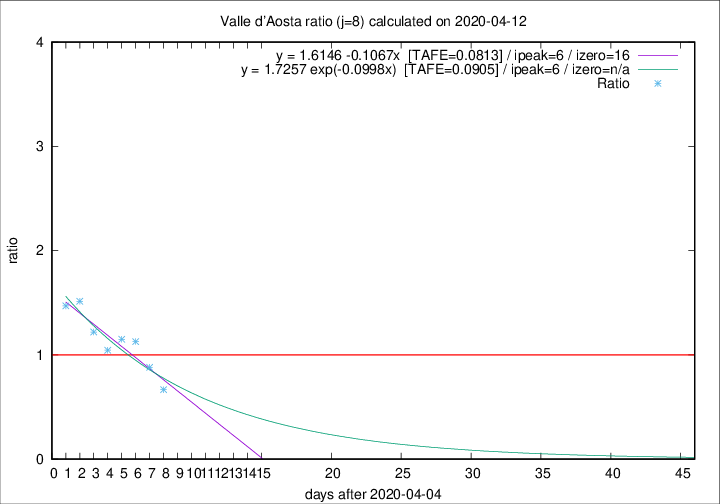

# Valle d'Aosta

Data source: https://raw.githubusercontent.com/pcm-dpc/COVID-19/master/dati-json/dpc-covid19-ita-regioni.json

Estimates in this page were made on 14/4/2020 with data available until 12/04/2020.

## Summary 

### Peak estimate 
|j|linear [TAFE]|exponential [TAFE]|power law [TAFE]|details|
|---|----|-----------|---------|-------|
|7|10/4/2020 [TAFE=0.1854]|10/4/2020 [TAFE=0.1985]|9/4/2020 [TAFE=0.2657]|[analysis](COVID-19_valle_d'aosta_j7_2020-04-12.md)|
|8|11/4/2020 [TAFE=0.0813]|11/4/2020 [TAFE=0.0905]|11/4/2020 [TAFE=0.1155]|[analysis](COVID-19_valle_d'aosta_j8_2020-04-12.md)|
|9|12/4/2020 [TAFE=0.0840]|12/4/2020 [TAFE=0.0624]|13/4/2020 [TAFE=0.0647]|[analysis](COVID-19_valle_d'aosta_j9_2020-04-12.md)|
|10|12/4/2020 [TAFE=0.0965]|12/4/2020 [TAFE=0.0622]|14/4/2020 [TAFE=0.1006]|[analysis](COVID-19_valle_d'aosta_j10_2020-04-12.md)|
|11|12/4/2020 [TAFE=0.3059]|13/4/2020 [TAFE=0.1047]|15/4/2020 [TAFE=0.0943]|[analysis](COVID-19_valle_d'aosta_j11_2020-04-12.md)|
|12|12/4/2020 [TAFE=0.2661]|14/4/2020 [TAFE=0.0941]|20/4/2020 [TAFE=0.2385]|[analysis](COVID-19_valle_d'aosta_j12_2020-04-12.md)|
|13|12/4/2020 [TAFE=0.3620]|14/4/2020 [TAFE=0.1259]|24/4/2020 [TAFE=0.2573]|[analysis](COVID-19_valle_d'aosta_j13_2020-04-12.md)|
|14|12/4/2020 [TAFE=0.5289]|15/4/2020 [TAFE=0.1454]|30/4/2020 [TAFE=0.3191]|[analysis](COVID-19_valle_d'aosta_j14_2020-04-12.md)|

Best estimator is exp with j=10 (TAFE=0.0622)
Corresponding peak date estimate is 12/4/2020 (ipeak 9)

Peak date range estimate: 6/4/2020 - 4/5/2020

### End estimate 
|j|linear [TAFE/TFE]|exponential [TAFE/TFE]|power law [TAFE/TFE]|details|
|---|----|-----------|---------|-------|
|7|18/4/2020 [TAFE=0.1854]|-|-|[analysis](COVID-19_valle_d'aosta_j7_2020-04-12.md)|
|8|21/4/2020 [TAFE=0.0813]|-|-|[analysis](COVID-19_valle_d'aosta_j8_2020-04-12.md)|
|9|-|-|-|[analysis](COVID-19_valle_d'aosta_j9_2020-04-12.md)|
|10|-|-|-|[analysis](COVID-19_valle_d'aosta_j10_2020-04-12.md)|
|11|-|-|-|[analysis](COVID-19_valle_d'aosta_j11_2020-04-12.md)|
|12|-|-|-|[analysis](COVID-19_valle_d'aosta_j12_2020-04-12.md)|
|13|-|-|-|[analysis](COVID-19_valle_d'aosta_j13_2020-04-12.md)|
|14|-|-|-|[analysis](COVID-19_valle_d'aosta_j14_2020-04-12.md)|

Best estimator is linear with j=8 (TAFE=0.0813)
Corresponding end date estimate is 21/4/2020 (izero 16)

End date range estimate: 5/4/2020 - 21/4/2020

Generated April 14th, 2020 at 19:16:04 UTC+0200 with https://github.com/robianc/COVID-19
