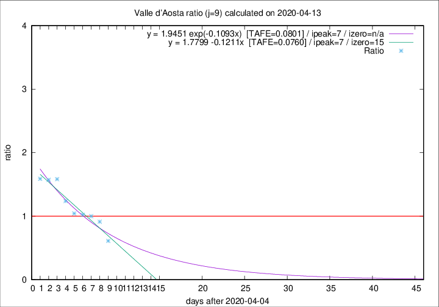

# Valle d'Aosta

Data source: https://raw.githubusercontent.com/pcm-dpc/COVID-19/master/dati-json/dpc-covid19-ita-regioni.json

Estimates in this page were made on 16/4/2020 with data available until 13/04/2020.

## Summary 

### Peak estimate 
|j|linear [TAFE]|exponential [TAFE]|power law [TAFE]|details|
|---|----|-----------|---------|-------|
|7|11/4/2020 [TAFE=0.1439]|10/4/2020 [TAFE=0.1479]|10/4/2020 [TAFE=0.2510]|[analysis](COVID-19_valle_d'aosta_j7_2020-04-13.md)|
|8|11/4/2020 [TAFE=0.1008]|11/4/2020 [TAFE=0.1175]|10/4/2020 [TAFE=0.1569]|[analysis](COVID-19_valle_d'aosta_j8_2020-04-13.md)|
|9|12/4/2020 [TAFE=0.0760]|12/4/2020 [TAFE=0.0801]|11/4/2020 [TAFE=0.1202]|[analysis](COVID-19_valle_d'aosta_j9_2020-04-13.md)|
|10|13/4/2020 [TAFE=0.1182]|13/4/2020 [TAFE=0.0763]|13/4/2020 [TAFE=0.0842]|[analysis](COVID-19_valle_d'aosta_j10_2020-04-13.md)|
|11|13/4/2020 [TAFE=0.2271]|13/4/2020 [TAFE=0.0888]|15/4/2020 [TAFE=0.0664]|[analysis](COVID-19_valle_d'aosta_j11_2020-04-13.md)|
|12|13/4/2020 [TAFE=0.3242]|14/4/2020 [TAFE=0.1053]|18/4/2020 [TAFE=0.1856]|[analysis](COVID-19_valle_d'aosta_j12_2020-04-13.md)|
|13|13/4/2020 [TAFE=0.2829]|15/4/2020 [TAFE=0.1090]|23/4/2020 [TAFE=0.2980]|[analysis](COVID-19_valle_d'aosta_j13_2020-04-13.md)|
|14|12/4/2020 [TAFE=0.5961]|15/4/2020 [TAFE=0.1504]|25/4/2020 [TAFE=0.2539]|[analysis](COVID-19_valle_d'aosta_j14_2020-04-13.md)|

Best estimator is pow with j=11 (TAFE=0.0664)
Corresponding peak date estimate is 15/4/2020 (ipeak 12)

Peak date range estimate: 6/4/2020 - 28/4/2020

### End estimate 
|j|linear [TAFE/TFE]|exponential [TAFE/TFE]|power law [TAFE/TFE]|details|
|---|----|-----------|---------|-------|
|7|17/4/2020 [TAFE=0.1439]|-|-|[analysis](COVID-19_valle_d'aosta_j7_2020-04-13.md)|
|8|19/4/2020 [TAFE=0.1008]|-|-|[analysis](COVID-19_valle_d'aosta_j8_2020-04-13.md)|
|9|20/4/2020 [TAFE=0.0760]|-|-|[analysis](COVID-19_valle_d'aosta_j9_2020-04-13.md)|
|10|-|-|-|[analysis](COVID-19_valle_d'aosta_j10_2020-04-13.md)|
|11|-|-|-|[analysis](COVID-19_valle_d'aosta_j11_2020-04-13.md)|
|12|-|-|-|[analysis](COVID-19_valle_d'aosta_j12_2020-04-13.md)|
|13|-|-|-|[analysis](COVID-19_valle_d'aosta_j13_2020-04-13.md)|
|14|-|-|-|[analysis](COVID-19_valle_d'aosta_j14_2020-04-13.md)|

Best estimator is linear with j=9 (TAFE=0.0760)
Corresponding end date estimate is 20/4/2020 (izero 15)

End date range estimate: 5/4/2020 - 20/4/2020

Generated April 16th, 2020 at 20:09:19 UTC+0200 with https://github.com/robianc/COVID-19
