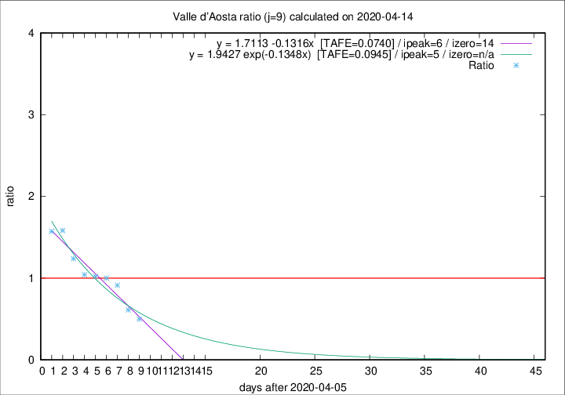

# Valle d'Aosta

Data source: https://raw.githubusercontent.com/pcm-dpc/COVID-19/master/dati-json/dpc-covid19-ita-regioni.json

Delta days analysis (j): 9

Analyses for other values of j for 2020-04-14 are avalable [here](../2020-04-14/README.md)

Analyses for Valle d'Aosta for previous dates are avalable [here](../README.md)

## Fitting 
|fit type|best fit equation|tafe|tfe|ipeak|izero|
|-------|-----|--------|------|---|---|
|linear|y = 1.7113 -0.1316x  [TAFE=0.0740]|0.0740|0.0077|6|14|
|exp|y = 1.9427 exp(-0.1348x)  [TAFE=0.0945]|0.0945|0.0056|5|n/a|

## Data
|Date|Daily deaths|Cumulated deaths|Deaths in the last 9 days|Deaths in the 9 days before|ratio|
|----|----------|-----------|-------|--------------------|-----|
|2020-04-14|3|118|27|54|0.5000|
|2020-04-13|3|115|33|54|0.6111|
|2020-04-12|5|112|42|46|0.9130|
|2020-04-11|0|107|44|44|1.0000|
|2020-04-10|2|107|48|47|1.0213|
|2020-04-09|3|105|49|47|1.0426|
|2020-04-08|2|102|52|42|1.2381|
|2020-04-07|4|100|57|36|1.5833|
|2020-04-06|5|96|55|35|1.5714|

[Download data as CSV](COVID-19_valle_d'aosta_j9_2020-04-14.csv)

Generated April 16th, 2020 at 20:09:19 UTC+0200 with https://github.com/robianc/COVID-19
