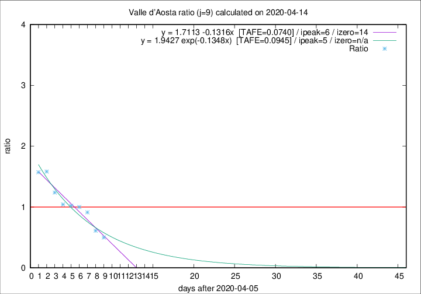

# Valle d'Aosta

Data source: https://raw.githubusercontent.com/pcm-dpc/COVID-19/master/dati-json/dpc-covid19-ita-regioni.json

Estimates in this page were made on 19/4/2020 with data available until 14/04/2020.

## Summary 

### Peak estimate 
|j|linear [TAFE]|exponential [TAFE]|power law [TAFE]|details|
|---|----|-----------|---------|-------|
|7|11/4/2020 [TAFE=0.1901]|11/4/2020 [TAFE=0.1469]|10/4/2020 [TAFE=0.1671]|[analysis](COVID-19_valle_d'aosta_j7_2020-04-14.md)|
|8|11/4/2020 [TAFE=0.1040]|11/4/2020 [TAFE=0.1365]|10/4/2020 [TAFE=0.2085]|[analysis](COVID-19_valle_d'aosta_j8_2020-04-14.md)|
|9|12/4/2020 [TAFE=0.0740]|11/4/2020 [TAFE=0.0945]|11/4/2020 [TAFE=0.1609]|[analysis](COVID-19_valle_d'aosta_j9_2020-04-14.md)|
|10|13/4/2020 [TAFE=0.1061]|13/4/2020 [TAFE=0.0821]|12/4/2020 [TAFE=0.0911]|[analysis](COVID-19_valle_d'aosta_j10_2020-04-14.md)|
|11|13/4/2020 [TAFE=0.1713]|14/4/2020 [TAFE=0.0778]|14/4/2020 [TAFE=0.0825]|[analysis](COVID-19_valle_d'aosta_j11_2020-04-14.md)|
|12|13/4/2020 [TAFE=0.3742]|14/4/2020 [TAFE=0.1289]|16/4/2020 [TAFE=0.1170]|[analysis](COVID-19_valle_d'aosta_j12_2020-04-14.md)|
|13|14/4/2020 [TAFE=0.3575]|15/4/2020 [TAFE=0.1112]|20/4/2020 [TAFE=0.2426]|[analysis](COVID-19_valle_d'aosta_j13_2020-04-14.md)|
|14|13/4/2020 [TAFE=0.4782]|16/4/2020 [TAFE=0.1415]|24/4/2020 [TAFE=0.2814]|[analysis](COVID-19_valle_d'aosta_j14_2020-04-14.md)|

Best estimator is linear with j=9 (TAFE=0.0740)
Corresponding peak date estimate is 12/4/2020 (ipeak 6)

Peak date range estimate: 8/4/2020 - 29/4/2020

### End estimate 
|j|linear [TAFE/TFE]|exponential [TAFE/TFE]|power law [TAFE/TFE]|details|
|---|----|-----------|---------|-------|
|7|17/4/2020 [TAFE=0.1901]|-|-|[analysis](COVID-19_valle_d'aosta_j7_2020-04-14.md)|
|8|19/4/2020 [TAFE=0.1040]|-|-|[analysis](COVID-19_valle_d'aosta_j8_2020-04-14.md)|
|9|20/4/2020 [TAFE=0.0740]|-|-|[analysis](COVID-19_valle_d'aosta_j9_2020-04-14.md)|
|10|-|-|-|[analysis](COVID-19_valle_d'aosta_j10_2020-04-14.md)|
|11|-|-|-|[analysis](COVID-19_valle_d'aosta_j11_2020-04-14.md)|
|12|-|-|-|[analysis](COVID-19_valle_d'aosta_j12_2020-04-14.md)|
|13|-|-|-|[analysis](COVID-19_valle_d'aosta_j13_2020-04-14.md)|
|14|-|-|-|[analysis](COVID-19_valle_d'aosta_j14_2020-04-14.md)|

Best estimator is linear with j=9 (TAFE=0.0740)
Corresponding end date estimate is 20/4/2020 (izero 14)

End date range estimate: 6/4/2020 - 20/4/2020

Generated April 19th, 2020 at 18:42:39 UTC+0200 with https://github.com/robianc/COVID-19
