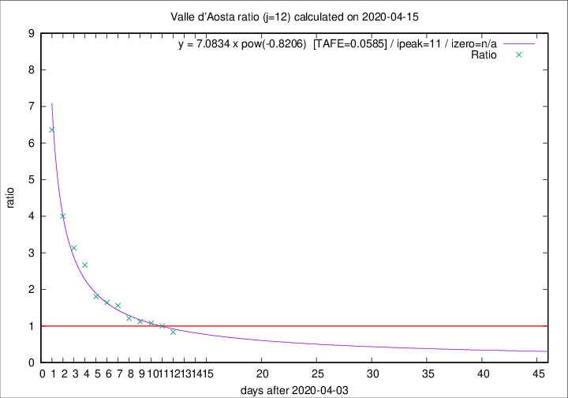

# Valle d'Aosta

Data source: https://raw.githubusercontent.com/pcm-dpc/COVID-19/master/dati-json/dpc-covid19-ita-regioni.json

Estimates in this page were made on 19/4/2020 with data available until 15/04/2020.

## Summary 

### Peak estimate 
|j|linear [TAFE]|exponential [TAFE]|power law [TAFE]|details|
|---|----|-----------|---------|-------|
|7|11/4/2020 [TAFE=0.2661]|11/4/2020 [TAFE=0.1890]|11/4/2020 [TAFE=0.1296]|[analysis](COVID-19_valle_d'aosta_j7_2020-04-15.md)|
|8|11/4/2020 [TAFE=0.1273]|11/4/2020 [TAFE=0.1184]|10/4/2020 [TAFE=0.2034]|[analysis](COVID-19_valle_d'aosta_j8_2020-04-15.md)|
|9|12/4/2020 [TAFE=0.0879]|12/4/2020 [TAFE=0.0847]|11/4/2020 [TAFE=0.1475]|[analysis](COVID-19_valle_d'aosta_j9_2020-04-15.md)|
|10|13/4/2020 [TAFE=0.0610]|12/4/2020 [TAFE=0.0845]|11/4/2020 [TAFE=0.1686]|[analysis](COVID-19_valle_d'aosta_j10_2020-04-15.md)|
|11|14/4/2020 [TAFE=0.1476]|14/4/2020 [TAFE=0.0757]|13/4/2020 [TAFE=0.0966]|[analysis](COVID-19_valle_d'aosta_j11_2020-04-15.md)|
|12|14/4/2020 [TAFE=0.3411]|15/4/2020 [TAFE=0.1263]|15/4/2020 [TAFE=0.0585]|[analysis](COVID-19_valle_d'aosta_j12_2020-04-15.md)|
|13|14/4/2020 [TAFE=0.4317]|15/4/2020 [TAFE=0.1345]|18/4/2020 [TAFE=0.1760]|[analysis](COVID-19_valle_d'aosta_j13_2020-04-15.md)|
|14|15/4/2020 [TAFE=0.3972]|16/4/2020 [TAFE=0.1321]|23/4/2020 [TAFE=0.3003]|[analysis](COVID-19_valle_d'aosta_j14_2020-04-15.md)|

Best estimator is pow with j=12 (TAFE=0.0585)
Corresponding peak date estimate is 15/4/2020 (ipeak 11)

Peak date range estimate: 6/4/2020 - 25/4/2020

### End estimate 
|j|linear [TAFE/TFE]|exponential [TAFE/TFE]|power law [TAFE/TFE]|details|
|---|----|-----------|---------|-------|
|7|18/4/2020 [TAFE=0.2661]|-|-|[analysis](COVID-19_valle_d'aosta_j7_2020-04-15.md)|
|8|19/4/2020 [TAFE=0.1273]|-|-|[analysis](COVID-19_valle_d'aosta_j8_2020-04-15.md)|
|9|20/4/2020 [TAFE=0.0879]|-|-|[analysis](COVID-19_valle_d'aosta_j9_2020-04-15.md)|
|10|20/4/2020 [TAFE=0.0610]|-|-|[analysis](COVID-19_valle_d'aosta_j10_2020-04-15.md)|
|11|-|-|-|[analysis](COVID-19_valle_d'aosta_j11_2020-04-15.md)|
|12|-|-|-|[analysis](COVID-19_valle_d'aosta_j12_2020-04-15.md)|
|13|-|-|-|[analysis](COVID-19_valle_d'aosta_j13_2020-04-15.md)|
|14|-|-|-|[analysis](COVID-19_valle_d'aosta_j14_2020-04-15.md)|

Best estimator is linear with j=10 (TAFE=0.0610)
Corresponding end date estimate is 20/4/2020 (izero 14)

End date range estimate: 6/4/2020 - 20/4/2020

Generated April 19th, 2020 at 18:42:39 UTC+0200 with https://github.com/robianc/COVID-19
