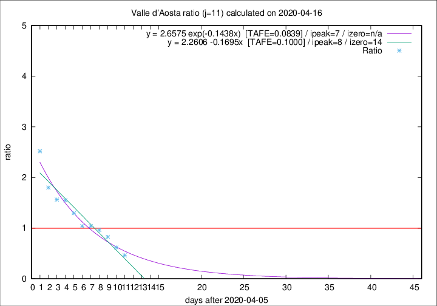

# Valle d'Aosta

Data source: https://raw.githubusercontent.com/pcm-dpc/COVID-19/master/dati-json/dpc-covid19-ita-regioni.json

Delta days analysis (j): 11

Analyses for other values of j for 2020-04-16 are avalable [here](../2020-04-16/README.md)

Analyses for Valle d'Aosta for previous dates are avalable [here](../README.md)

## Fitting 
|fit type|best fit equation|tafe|tfe|ipeak|izero|
|-------|-----|--------|------|---|---|
|linear|y = 2.2606 -0.1695x  [TAFE=0.1000]|0.1000|-0.0040|8|14|
|exp|y = 2.6575 exp(-0.1438x)  [TAFE=0.0839]|0.0839|0.0050|7|n/a|

## Data
|Date|Daily deaths|Cumulated deaths|Deaths in the last 11 days|Deaths in the 11 days before|ratio|
|----|----------|-----------|-------|--------------------|-----|
|2020-04-16|1|122|31|67|0.4627|
|2020-04-15|3|121|39|63|0.6190|
|2020-04-14|3|118|48|58|0.8276|
|2020-04-13|3|115|52|54|0.9630|
|2020-04-12|5|112|53|51|1.0392|
|2020-04-11|0|107|51|49|1.0408|
|2020-04-10|2|107|57|44|1.2955|
|2020-04-09|3|105|62|40|1.5500|
|2020-04-08|2|102|61|39|1.5641|
|2020-04-07|4|100|63|35|1.8000|
|2020-04-06|5|96|68|27|2.5185|

[Download data as CSV](COVID-19_valle_d'aosta_j11_2020-04-16.csv)

Generated April 19th, 2020 at 18:42:39 UTC+0200 with https://github.com/robianc/COVID-19
