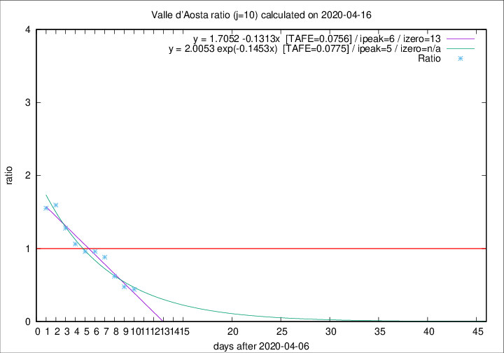

# Valle d'Aosta

Data source: https://raw.githubusercontent.com/pcm-dpc/COVID-19/master/dati-json/dpc-covid19-ita-regioni.json

Estimates in this page were made on 16/4/2020 with data available until 16/04/2020.

## Summary 

### Peak estimate 
|j|linear [TAFE]|exponential [TAFE]|power law [TAFE]|details|
|---|----|-----------|---------|-------|
|7|12/4/2020 [TAFE=0.2639]|12/4/2020 [TAFE=0.1929]|12/4/2020 [TAFE=0.1298]|[analysis](COVID-19_valle_d'aosta_j7_2020-04-16.md)|
|8|11/4/2020 [TAFE=0.1596]|11/4/2020 [TAFE=0.1076]|11/4/2020 [TAFE=0.1307]|[analysis](COVID-19_valle_d'aosta_j8_2020-04-16.md)|
|9|12/4/2020 [TAFE=0.0762]|11/4/2020 [TAFE=0.0848]|11/4/2020 [TAFE=0.1668]|[analysis](COVID-19_valle_d'aosta_j9_2020-04-16.md)|
|10|13/4/2020 [TAFE=0.0756]|12/4/2020 [TAFE=0.0775]|11/4/2020 [TAFE=0.1841]|[analysis](COVID-19_valle_d'aosta_j10_2020-04-16.md)|
|11|14/4/2020 [TAFE=0.1000]|13/4/2020 [TAFE=0.0839]|12/4/2020 [TAFE=0.1489]|[analysis](COVID-19_valle_d'aosta_j11_2020-04-16.md)|
|12|15/4/2020 [TAFE=0.2246]|15/4/2020 [TAFE=0.1005]|15/4/2020 [TAFE=0.1065]|[analysis](COVID-19_valle_d'aosta_j12_2020-04-16.md)|
|13|15/4/2020 [TAFE=0.4708]|16/4/2020 [TAFE=0.1538]|17/4/2020 [TAFE=0.0965]|[analysis](COVID-19_valle_d'aosta_j13_2020-04-16.md)|
|14|15/4/2020 [TAFE=0.4842]|16/4/2020 [TAFE=0.1466]|20/4/2020 [TAFE=0.2319]|[analysis](COVID-19_valle_d'aosta_j14_2020-04-16.md)|

Best estimator is linear with j=10 (TAFE=0.0756)
Corresponding peak date estimate is 13/4/2020 (ipeak 6)

Peak date range estimate: 9/4/2020 - 24/4/2020

### End estimate 
|j|linear [TAFE/TFE]|exponential [TAFE/TFE]|power law [TAFE/TFE]|details|
|---|----|-----------|---------|-------|
|7|21/4/2020 [TAFE=0.2639]|-|-|[analysis](COVID-19_valle_d'aosta_j7_2020-04-16.md)|
|8|20/4/2020 [TAFE=0.1596]|-|-|[analysis](COVID-19_valle_d'aosta_j8_2020-04-16.md)|
|9|21/4/2020 [TAFE=0.0762]|-|-|[analysis](COVID-19_valle_d'aosta_j9_2020-04-16.md)|
|10|20/4/2020 [TAFE=0.0756]|-|-|[analysis](COVID-19_valle_d'aosta_j10_2020-04-16.md)|
|11|-|-|-|[analysis](COVID-19_valle_d'aosta_j11_2020-04-16.md)|
|12|-|-|-|[analysis](COVID-19_valle_d'aosta_j12_2020-04-16.md)|
|13|-|-|-|[analysis](COVID-19_valle_d'aosta_j13_2020-04-16.md)|
|14|-|-|-|[analysis](COVID-19_valle_d'aosta_j14_2020-04-16.md)|

Best estimator is linear with j=10 (TAFE=0.0756)
Corresponding end date estimate is 20/4/2020 (izero 13)

End date range estimate: 7/4/2020 - 21/4/2020

Generated April 16th, 2020 at 20:09:19 UTC+0200 with https://github.com/robianc/COVID-19
