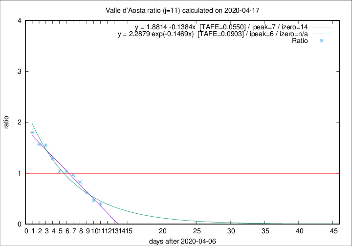

# Valle d'Aosta

Data source: https://raw.githubusercontent.com/pcm-dpc/COVID-19/master/dati-json/dpc-covid19-ita-regioni.json

Estimates in this page were made on 19/4/2020 with data available until 17/04/2020.

## Summary 

### Peak estimate 
|j|linear [TAFE]|exponential [TAFE]|power law [TAFE]|details|
|---|----|-----------|---------|-------|
|7|13/4/2020 [TAFE=0.0944]|13/4/2020 [TAFE=0.0892]|13/4/2020 [TAFE=0.0741]|[analysis](COVID-19_valle_d'aosta_j7_2020-04-17.md)|
|8|12/4/2020 [TAFE=0.2013]|12/4/2020 [TAFE=0.1408]|12/4/2020 [TAFE=0.0787]|[analysis](COVID-19_valle_d'aosta_j8_2020-04-17.md)|
|9|12/4/2020 [TAFE=0.1174]|12/4/2020 [TAFE=0.0974]|11/4/2020 [TAFE=0.1502]|[analysis](COVID-19_valle_d'aosta_j9_2020-04-17.md)|
|10|13/4/2020 [TAFE=0.0968]|12/4/2020 [TAFE=0.0646]|12/4/2020 [TAFE=0.1503]|[analysis](COVID-19_valle_d'aosta_j10_2020-04-17.md)|
|11|14/4/2020 [TAFE=0.0550]|13/4/2020 [TAFE=0.0903]|12/4/2020 [TAFE=0.2060]|[analysis](COVID-19_valle_d'aosta_j11_2020-04-17.md)|
|12|15/4/2020 [TAFE=0.1734]|14/4/2020 [TAFE=0.1001]|14/4/2020 [TAFE=0.1679]|[analysis](COVID-19_valle_d'aosta_j12_2020-04-17.md)|
|13|16/4/2020 [TAFE=0.3987]|16/4/2020 [TAFE=0.1271]|16/4/2020 [TAFE=0.0984]|[analysis](COVID-19_valle_d'aosta_j13_2020-04-17.md)|
|14|16/4/2020 [TAFE=0.5640]|17/4/2020 [TAFE=0.1620]|19/4/2020 [TAFE=0.1584]|[analysis](COVID-19_valle_d'aosta_j14_2020-04-17.md)|

Best estimator is linear with j=11 (TAFE=0.0550)
Corresponding peak date estimate is 14/4/2020 (ipeak 7)

Peak date range estimate: 9/4/2020 - 22/4/2020

### End estimate 
|j|linear [TAFE/TFE]|exponential [TAFE/TFE]|power law [TAFE/TFE]|details|
|---|----|-----------|---------|-------|
|7|8/5/2020 [TAFE=0.0944]|-|-|[analysis](COVID-19_valle_d'aosta_j7_2020-04-17.md)|
|8|-|-|-|[analysis](COVID-19_valle_d'aosta_j8_2020-04-17.md)|
|9|-|-|-|[analysis](COVID-19_valle_d'aosta_j9_2020-04-17.md)|
|10|-|-|-|[analysis](COVID-19_valle_d'aosta_j10_2020-04-17.md)|
|11|21/4/2020 [TAFE=0.0550]|-|-|[analysis](COVID-19_valle_d'aosta_j11_2020-04-17.md)|
|12|-|-|-|[analysis](COVID-19_valle_d'aosta_j12_2020-04-17.md)|
|13|-|-|-|[analysis](COVID-19_valle_d'aosta_j13_2020-04-17.md)|
|14|-|-|-|[analysis](COVID-19_valle_d'aosta_j14_2020-04-17.md)|

Best estimator is linear with j=11 (TAFE=0.0550)
Corresponding end date estimate is 21/4/2020 (izero 14)

End date range estimate: 7/4/2020 - 4/5/2020

Generated April 19th, 2020 at 18:42:39 UTC+0200 with https://github.com/robianc/COVID-19
