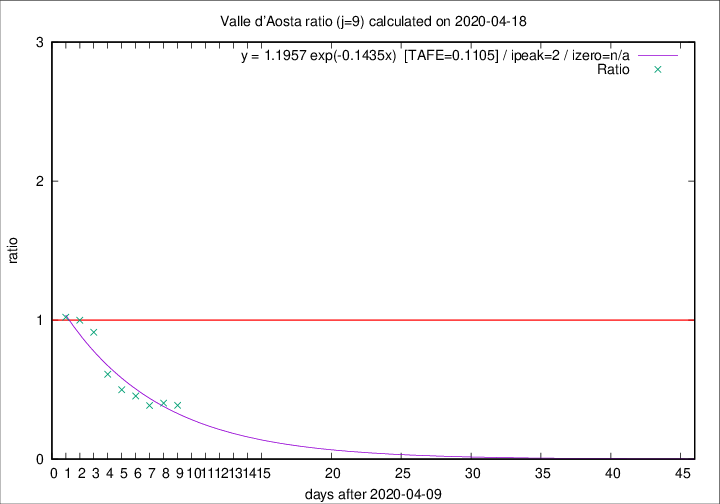

# Valle d'Aosta

Data source: https://raw.githubusercontent.com/pcm-dpc/COVID-19/master/dati-json/dpc-covid19-ita-regioni.json

Delta days analysis (j): 9

Analyses for other values of j for 2020-04-18 are avalable [here](../2020-04-18/README.md)

Analyses for Valle d'Aosta for previous dates are avalable [here](../README.md)

## Fitting 
|fit type|best fit equation|tafe|tfe|ipeak|izero|
|-------|-----|--------|------|---|---|
|exp|y = 1.1957 exp(-0.1435x)  [TAFE=0.1105]|0.1105|0.0073|2|n/a|

## Data
|Date|Daily deaths|Cumulated deaths|Deaths in the last 9 days|Deaths in the 9 days before|ratio|
|----|----------|-----------|-------|--------------------|-----|
|2020-04-18|1|124|19|49|0.3878|
|2020-04-17|1|123|21|52|0.4038|
|2020-04-16|1|122|22|57|0.3860|
|2020-04-15|3|121|25|55|0.4545|
|2020-04-14|3|118|27|54|0.5000|
|2020-04-13|3|115|33|54|0.6111|
|2020-04-12|5|112|42|46|0.9130|
|2020-04-11|0|107|44|44|1.0000|
|2020-04-10|2|107|48|47|1.0213|

[Download data as CSV](COVID-19_valle_d'aosta_j9_2020-04-18.csv)

Generated April 19th, 2020 at 18:42:39 UTC+0200 with https://github.com/robianc/COVID-19
