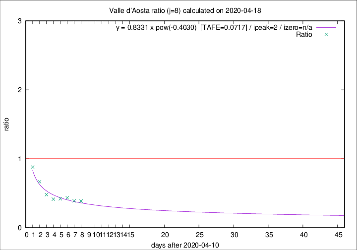
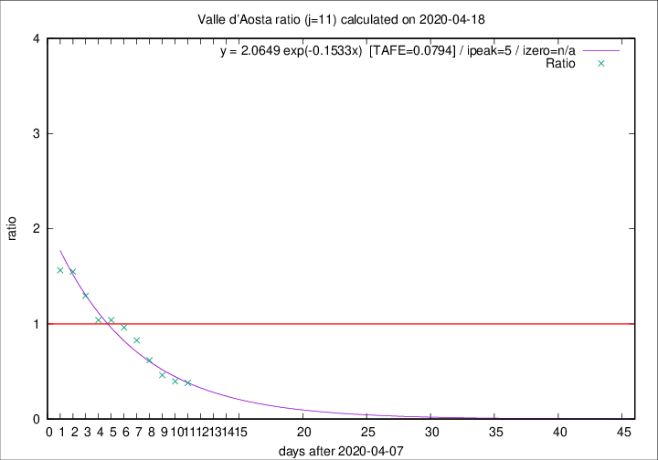

# Valle d'Aosta

Data source: https://raw.githubusercontent.com/pcm-dpc/COVID-19/master/dati-json/dpc-covid19-ita-regioni.json

Estimates in this page were made on 19/4/2020 with data available until 18/04/2020.

## Summary 

### Peak estimate 
|j|linear [TAFE]|exponential [TAFE]|power law [TAFE]|details|
|---|----|-----------|---------|-------|
|7|14/4/2020 [TAFE=0.1212]|14/4/2020 [TAFE=0.1077]|14/4/2020 [TAFE=0.1189]|[analysis](COVID-19_valle_d'aosta_j7_2020-04-18.md)|
|8|13/4/2020 [TAFE=0.1519]|13/4/2020 [TAFE=0.1228]|13/4/2020 [TAFE=0.0717]|[analysis](COVID-19_valle_d'aosta_j8_2020-04-18.md)|
|9|12/4/2020 [TAFE=0.1616]|12/4/2020 [TAFE=0.1105]|12/4/2020 [TAFE=0.1001]|[analysis](COVID-19_valle_d'aosta_j9_2020-04-18.md)|
|10|13/4/2020 [TAFE=0.1036]|12/4/2020 [TAFE=0.0746]|12/4/2020 [TAFE=0.1527]|[analysis](COVID-19_valle_d'aosta_j10_2020-04-18.md)|
|11|14/4/2020 [TAFE=0.0764]|13/4/2020 [TAFE=0.0794]|12/4/2020 [TAFE=0.2064]|[analysis](COVID-19_valle_d'aosta_j11_2020-04-18.md)|
|12|15/4/2020 [TAFE=0.1156]|14/4/2020 [TAFE=0.1004]|13/4/2020 [TAFE=0.2114]|[analysis](COVID-19_valle_d'aosta_j12_2020-04-18.md)|
|13|16/4/2020 [TAFE=0.2651]|15/4/2020 [TAFE=0.1103]|15/4/2020 [TAFE=0.1783]|[analysis](COVID-19_valle_d'aosta_j13_2020-04-18.md)|
|14|16/4/2020 [TAFE=0.5906]|17/4/2020 [TAFE=0.1498]|17/4/2020 [TAFE=0.1184]|[analysis](COVID-19_valle_d'aosta_j14_2020-04-18.md)|

Best estimator is pow with j=8 (TAFE=0.0717)
Corresponding peak date estimate is 13/4/2020 (ipeak 2)

Peak date range estimate: 13/4/2020 - 23/4/2020

### End estimate 
|j|linear [TAFE/TFE]|exponential [TAFE/TFE]|power law [TAFE/TFE]|details|
|---|----|-----------|---------|-------|
|7|-|-|-|[analysis](COVID-19_valle_d'aosta_j7_2020-04-18.md)|
|8|25/4/2020 [TAFE=0.1519]|-|-|[analysis](COVID-19_valle_d'aosta_j8_2020-04-18.md)|
|9|-|-|-|[analysis](COVID-19_valle_d'aosta_j9_2020-04-18.md)|
|10|22/4/2020 [TAFE=0.1036]|-|-|[analysis](COVID-19_valle_d'aosta_j10_2020-04-18.md)|
|11|22/4/2020 [TAFE=0.0764]|-|-|[analysis](COVID-19_valle_d'aosta_j11_2020-04-18.md)|
|12|-|-|-|[analysis](COVID-19_valle_d'aosta_j12_2020-04-18.md)|
|13|-|-|-|[analysis](COVID-19_valle_d'aosta_j13_2020-04-18.md)|
|14|-|-|-|[analysis](COVID-19_valle_d'aosta_j14_2020-04-18.md)|

Best estimator is linear with j=11 (TAFE=0.0764)
Corresponding end date estimate is 22/4/2020 (izero 14)

End date range estimate: 8/4/2020 - 22/4/2020

Generated April 19th, 2020 at 18:42:39 UTC+0200 with https://github.com/robianc/COVID-19
