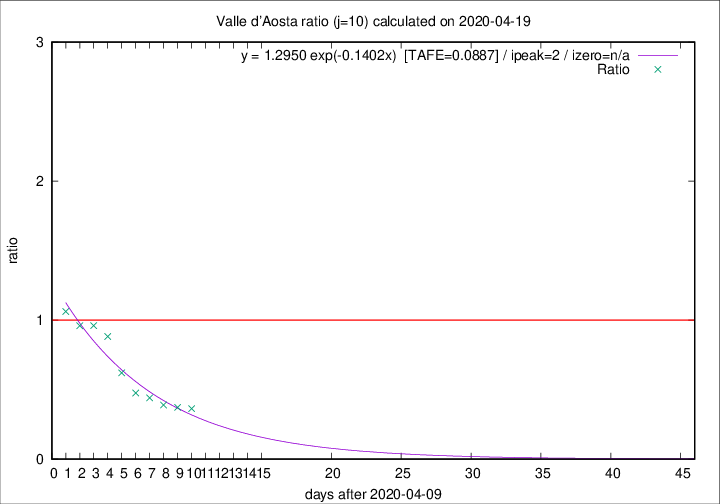

# Valle d'Aosta

Data source: https://raw.githubusercontent.com/pcm-dpc/COVID-19/master/dati-json/dpc-covid19-ita-regioni.json

Delta days analysis (j): 10

Analyses for other values of j for 2020-04-19 are avalable [here](../2020-04-19/README.md)

Analyses for Valle d'Aosta for previous dates are avalable [here](../README.md)

## Fitting 
|fit type|best fit equation|tafe|tfe|ipeak|izero|
|-------|-----|--------|------|---|---|
|exp|y = 1.2950 exp(-0.1402x)  [TAFE=0.0887]|0.0887|0.0052|2|n/a|

## Data
|Date|Daily deaths|Cumulated deaths|Deaths in the last 10 days|Deaths in the 10 days before|ratio|
|----|----------|-----------|-------|--------------------|-----|
|2020-04-19|1|125|20|55|0.3636|
|2020-04-18|1|124|22|59|0.3729|
|2020-04-17|1|123|23|59|0.3898|
|2020-04-16|1|122|26|59|0.4407|
|2020-04-15|3|121|30|63|0.4762|
|2020-04-14|3|118|36|58|0.6207|
|2020-04-13|3|115|45|51|0.8824|
|2020-04-12|5|112|49|51|0.9608|
|2020-04-11|0|107|48|50|0.9600|
|2020-04-10|2|107|51|48|1.0625|

[Download data as CSV](COVID-19_valle_d'aosta_j10_2020-04-19.csv)

Generated April 19th, 2020 at 18:42:39 UTC+0200 with https://github.com/robianc/COVID-19
