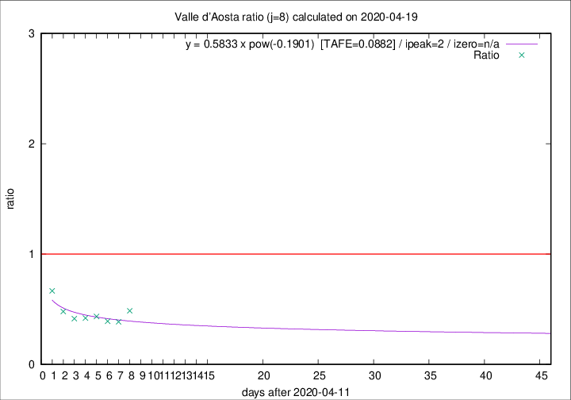

# Valle d'Aosta

Data source: https://raw.githubusercontent.com/pcm-dpc/COVID-19/master/dati-json/dpc-covid19-ita-regioni.json

Delta days analysis (j): 8

Analyses for other values of j for 2020-04-19 are avalable [here](../2020-04-19/README.md)

Analyses for Valle d'Aosta for previous dates are avalable [here](../README.md)

## Fitting 
|fit type|best fit equation|tafe|tfe|ipeak|izero|
|-------|-----|--------|------|---|---|
|pow|y = 0.5833 x pow(-0.1901)  [TAFE=0.0882]|0.0882|0.0058|2|n/a|

## Data
|Date|Daily deaths|Cumulated deaths|Deaths in the last 8 days|Deaths in the 8 days before|ratio|
|----|----------|-----------|-------|--------------------|-----|
|2020-04-19|1|125|18|37|0.4865|
|2020-04-18|1|124|17|44|0.3864|
|2020-04-17|1|123|18|46|0.3913|
|2020-04-16|1|122|20|46|0.4348|
|2020-04-15|3|121|21|50|0.4200|
|2020-04-14|3|118|22|53|0.4151|
|2020-04-13|3|115|24|50|0.4800|
|2020-04-12|5|112|30|45|0.6667|

[Download data as CSV](COVID-19_valle_d'aosta_j8_2020-04-19.csv)

Generated April 19th, 2020 at 18:42:39 UTC+0200 with https://github.com/robianc/COVID-19
