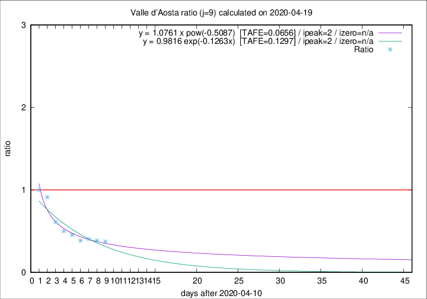

# Valle d'Aosta

Data source: https://raw.githubusercontent.com/pcm-dpc/COVID-19/master/dati-json/dpc-covid19-ita-regioni.json

Estimates in this page were made on 19/4/2020 with data available until 19/04/2020.

## Summary 

### Peak estimate 
|j|linear [TAFE]|exponential [TAFE]|power law [TAFE]|details|
|---|----|-----------|---------|-------|
|7|15/4/2020 [TAFE=0.1060]|15/4/2020 [TAFE=0.0966]|15/4/2020 [TAFE=0.1323]|[analysis](COVID-19_valle_d'aosta_j7_2020-04-19.md)|
|8|14/4/2020 [TAFE=0.1201]|14/4/2020 [TAFE=0.1109]|14/4/2020 [TAFE=0.0882]|[analysis](COVID-19_valle_d'aosta_j8_2020-04-19.md)|
|9|13/4/2020 [TAFE=0.1856]|13/4/2020 [TAFE=0.1297]|13/4/2020 [TAFE=0.0656]|[analysis](COVID-19_valle_d'aosta_j9_2020-04-19.md)|
|10|12/4/2020 [TAFE=0.1287]|12/4/2020 [TAFE=0.0887]|12/4/2020 [TAFE=0.1333]|[analysis](COVID-19_valle_d'aosta_j10_2020-04-19.md)|
|11|14/4/2020 [TAFE=0.1200]|13/4/2020 [TAFE=0.0801]|12/4/2020 [TAFE=0.1665]|[analysis](COVID-19_valle_d'aosta_j11_2020-04-19.md)|
|12|15/4/2020 [TAFE=0.0861]|14/4/2020 [TAFE=0.0972]|13/4/2020 [TAFE=0.2431]|[analysis](COVID-19_valle_d'aosta_j12_2020-04-19.md)|
|13|16/4/2020 [TAFE=0.1917]|15/4/2020 [TAFE=0.1051]|14/4/2020 [TAFE=0.2192]|[analysis](COVID-19_valle_d'aosta_j13_2020-04-19.md)|
|14|17/4/2020 [TAFE=0.4558]|16/4/2020 [TAFE=0.1189]|16/4/2020 [TAFE=0.1693]|[analysis](COVID-19_valle_d'aosta_j14_2020-04-19.md)|

Best estimator is pow with j=9 (TAFE=0.0656)
Corresponding peak date estimate is 13/4/2020 (ipeak 2)

Peak date range estimate: 13/4/2020 - 22/4/2020

### End estimate 
|j|linear [TAFE/TFE]|exponential [TAFE/TFE]|power law [TAFE/TFE]|details|
|---|----|-----------|---------|-------|
|7|-|-|-|[analysis](COVID-19_valle_d'aosta_j7_2020-04-19.md)|
|8|9/5/2020 [TAFE=0.1201]|-|-|[analysis](COVID-19_valle_d'aosta_j8_2020-04-19.md)|
|9|-|-|-|[analysis](COVID-19_valle_d'aosta_j9_2020-04-19.md)|
|10|-|-|-|[analysis](COVID-19_valle_d'aosta_j10_2020-04-19.md)|
|11|22/4/2020 [TAFE=0.1200]|-|-|[analysis](COVID-19_valle_d'aosta_j11_2020-04-19.md)|
|12|22/4/2020 [TAFE=0.0861]|-|-|[analysis](COVID-19_valle_d'aosta_j12_2020-04-19.md)|
|13|-|-|-|[analysis](COVID-19_valle_d'aosta_j13_2020-04-19.md)|
|14|-|-|-|[analysis](COVID-19_valle_d'aosta_j14_2020-04-19.md)|

Best estimator is linear with j=12 (TAFE=0.0861)
Corresponding end date estimate is 22/4/2020 (izero 14)

End date range estimate: 8/4/2020 - 5/5/2020

Generated April 19th, 2020 at 18:42:39 UTC+0200 with https://github.com/robianc/COVID-19
