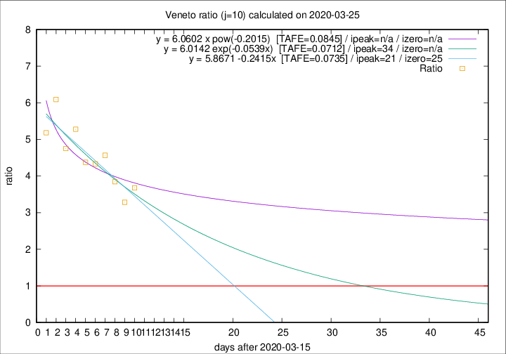

# Veneto

Data source: https://raw.githubusercontent.com/pcm-dpc/COVID-19/master/dati-json/dpc-covid19-ita-regioni.json

Delta days analysis (j): 10

Analyses for other values of j for 2020-03-25 are avalable [here](../README.md)

Analyses for Veneto for previous dates are avalable [here](../../README.md)

## Fitting 
|fit type|best fit equation|tafe|tfe|ipeak|izero|
|-------|-----|--------|------|---|---|
|linear|y = 5.8671 -0.2415x  [TAFE=0.0735]|0.0735|0.0066|21|25|
|exp|y = 6.0142 exp(-0.0539x)  [TAFE=0.0712]|0.0712|0.0036|34|n/a|
|pow|y = 6.0602 x pow(-0.2015)  [TAFE=0.0845]|0.0845|0.0055|n/a|n/a|

## Data
|Date|Daily deaths|Cumulated deaths|Deaths in the last 10 days|Deaths in the 10 days before|ratio|
|----|----------|-----------|-------|--------------------|-----|
|2020-03-25|42|258|195|53|3.6792|
|2020-03-24|24|216|161|49|3.2857|
|2020-03-23|23|192|150|39|3.8462|
|2020-03-22|23|169|137|30|4.5667|
|2020-03-21|15|146|117|27|4.3333|
|2020-03-20|16|131|105|24|4.3750|
|2020-03-19|21|115|95|18|5.2778|
|2020-03-18|14|94|76|16|4.7500|
|2020-03-17|11|80|67|11|6.0909|
|2020-03-16|6|69|57|11|5.1818|

[Download data as CSV](COVID-19_veneto_j10_2020-03-25.csv)

Generated April 12th, 2020 at 16:28:18 UTC+0200 with https://github.com/robianc/COVID-19
