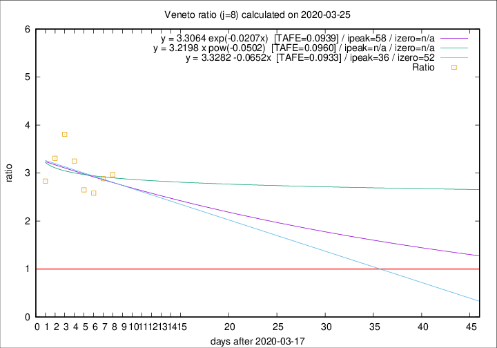

# Veneto

Data source: https://raw.githubusercontent.com/pcm-dpc/COVID-19/master/dati-json/dpc-covid19-ita-regioni.json

Delta days analysis (j): 8

## Fitting 
|fit type|best fit equation|tafe|tfe|ipeak|izero|
|-------|-----|--------|------|---|---|
|linear|y = 3.3282 -0.0652x  [TAFE=0.0933]|0.0933|0.0123|36|52|
|exp|y = 3.3064 exp(-0.0207x)  [TAFE=0.0939]|0.0939|0.0060|58|n/a|
|pow|y = 3.2198 x pow(-0.0502)  [TAFE=0.0960]|0.0960|0.0066|n/a|n/a|

## Data
|Date|Daily deaths|Cumulated deaths|Deaths in the last 8 days|Deaths in the 8 days before|ratio|
|----|----------|-----------|-------|--------------------|-----|
|2020-03-25|42|258|178|60|2.9667|
|2020-03-24|24|216|147|51|2.8824|
|2020-03-23|23|192|129|50|2.5800|
|2020-03-22|23|169|114|43|2.6512|
|2020-03-21|15|146|104|32|3.2500|
|2020-03-20|16|131|99|26|3.8077|
|2020-03-19|21|115|86|26|3.3077|
|2020-03-18|14|94|68|24|2.8333|

[Download data as CSV](COVID-19_veneto_j8_2020-03-25.csv)

Generated April 9th, 2020 at 16:40:48 UTC+0200 with https://github.com/robianc/COVID-19
