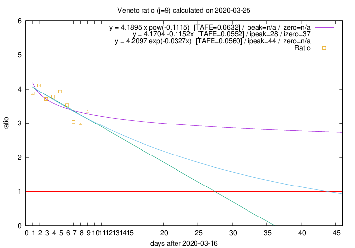

# Veneto

Data source: https://raw.githubusercontent.com/pcm-dpc/COVID-19/master/dati-json/dpc-covid19-ita-regioni.json

Delta days analysis (j): 9

Analyses for other values of j for 2020-03-25 are avalable [here](../2020-03-25/README.md)

Analyses for Veneto for previous dates are avalable [here](../README.md)

## Fitting 
|fit type|best fit equation|tafe|tfe|ipeak|izero|
|-------|-----|--------|------|---|---|
|linear|y = 4.1704 -0.1152x  [TAFE=0.0552]|0.0552|0.0039|28|37|
|exp|y = 4.2097 exp(-0.0327x)  [TAFE=0.0560]|0.0560|0.0019|44|n/a|
|pow|y = 4.1895 x pow(-0.1115)  [TAFE=0.0632]|0.0632|0.0027|n/a|n/a|

## Data
|Date|Daily deaths|Cumulated deaths|Deaths in the last 9 days|Deaths in the 9 days before|ratio|
|----|----------|-----------|-------|--------------------|-----|
|2020-03-25|42|258|189|56|3.3750|
|2020-03-24|24|216|153|51|3.0000|
|2020-03-23|23|192|137|45|3.0444|
|2020-03-22|23|169|127|36|3.5278|
|2020-03-21|15|146|114|29|3.9310|
|2020-03-20|16|131|102|27|3.7778|
|2020-03-19|21|115|89|24|3.7083|
|2020-03-18|14|94|74|18|4.1111|
|2020-03-17|11|80|62|16|3.8750|

[Download data as CSV](COVID-19_veneto_j9_2020-03-25.csv)

Generated April 12th, 2020 at 17:02:01 UTC+0200 with https://github.com/robianc/COVID-19
