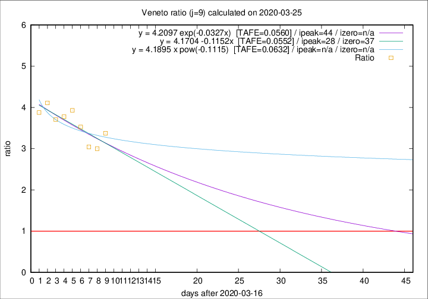

# Veneto

Data source: https://raw.githubusercontent.com/pcm-dpc/COVID-19/master/dati-json/dpc-covid19-ita-regioni.json

Estimates in this page were made on 12/4/2020 with data available until 25/03/2020.

## Summary 

### Peak estimate 
|j|linear [TAFE]|exponential [TAFE]|power law [TAFE]|details|
|---|----|-----------|---------|-------|
|7|3/4/2020 [TAFE=0.1156]|12/4/2020 [TAFE=0.1079]|-|[analysis](COVID-19_veneto_j7_2020-03-25.md)|
|8|23/4/2020 [TAFE=0.0933]|15/5/2020 [TAFE=0.0939]|-|[analysis](COVID-19_veneto_j8_2020-03-25.md)|
|9|14/4/2020 [TAFE=0.0552]|30/4/2020 [TAFE=0.0560]|-|[analysis](COVID-19_veneto_j9_2020-03-25.md)|
|10|6/4/2020 [TAFE=0.0735]|19/4/2020 [TAFE=0.0712]|-|[analysis](COVID-19_veneto_j10_2020-03-25.md)|
|11|-|-|-||
|12|-|-|-||
|13|-|-|-||
|14|-|-|-||

Best estimator is linear with j=9 (TAFE=0.0552)
Corresponding peak date estimate is 14/4/2020 (ipeak 28)

Peak date range estimate: 17/3/2020 - 14/5/2020

### End estimate 
|j|linear [TAFE/TFE]|exponential [TAFE/TFE]|power law [TAFE/TFE]|details|
|---|----|-----------|---------|-------|
|7|10/4/2020 [TAFE=0.1156]|-|-|[analysis](COVID-19_veneto_j7_2020-03-25.md)|
|8|9/5/2020 [TAFE=0.0933]|-|-|[analysis](COVID-19_veneto_j8_2020-03-25.md)|
|9|23/4/2020 [TAFE=0.0552]|-|-|[analysis](COVID-19_veneto_j9_2020-03-25.md)|
|10|-|-|-|[analysis](COVID-19_veneto_j10_2020-03-25.md)|
|11|-|-|-||
|12|-|-|-||
|13|-|-|-||
|14|-|-|-||

Best estimator is linear with j=9 (TAFE=0.0552)
Corresponding end date estimate is 23/4/2020 (izero 37)

End date range estimate: 17/3/2020 - 8/5/2020

Generated April 12th, 2020 at 17:02:01 UTC+0200 with https://github.com/robianc/COVID-19
