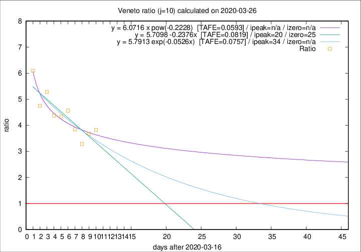

# Veneto

Data source: https://raw.githubusercontent.com/pcm-dpc/COVID-19/master/dati-json/dpc-covid19-ita-regioni.json

Delta days analysis (j): 10

Analyses for other values of j for 2020-03-26 are avalable [here](../2020-03-26/README.md)

Analyses for Veneto for previous dates are avalable [here](../README.md)

## Fitting 
|fit type|best fit equation|tafe|tfe|ipeak|izero|
|-------|-----|--------|------|---|---|
|linear|y = 5.7098 -0.2376x  [TAFE=0.0819]|0.0819|0.0070|20|25|
|exp|y = 5.7913 exp(-0.0526x)  [TAFE=0.0757]|0.0757|0.0036|34|n/a|
|pow|y = 6.0716 x pow(-0.2228)  [TAFE=0.0593]|0.0593|0.0031|n/a|n/a|

## Data
|Date|Daily deaths|Cumulated deaths|Deaths in the last 10 days|Deaths in the 10 days before|ratio|
|----|----------|-----------|-------|--------------------|-----|
|2020-03-26|29|287|218|57|3.8246|
|2020-03-25|42|258|195|53|3.6792|
|2020-03-24|24|216|161|49|3.2857|
|2020-03-23|23|192|150|39|3.8462|
|2020-03-22|23|169|137|30|4.5667|
|2020-03-21|15|146|117|27|4.3333|
|2020-03-20|16|131|105|24|4.3750|
|2020-03-19|21|115|95|18|5.2778|
|2020-03-18|14|94|76|16|4.7500|
|2020-03-17|11|80|67|11|6.0909|

[Download data as CSV](COVID-19_veneto_j10_2020-03-26.csv)

Generated April 14th, 2020 at 19:16:04 UTC+0200 with https://github.com/robianc/COVID-19
