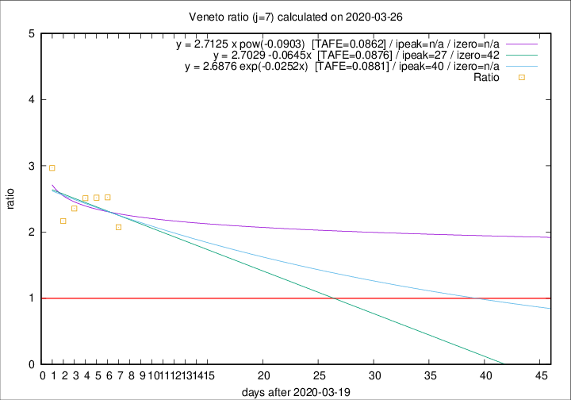

# Veneto

Data source: https://raw.githubusercontent.com/pcm-dpc/COVID-19/master/dati-json/dpc-covid19-ita-regioni.json

Delta days analysis (j): 7

Analyses for other values of j for 2020-03-26 are avalable [here](../README.md)

Analyses for Veneto for previous dates are avalable [here](../../README.md)

## Fitting 
|fit type|best fit equation|tafe|tfe|ipeak|izero|
|-------|-----|--------|------|---|---|
|linear|y = 2.7029 -0.0645x  [TAFE=0.0876]|0.0876|0.0094|27|42|
|exp|y = 2.6876 exp(-0.0252x)  [TAFE=0.0881]|0.0881|0.0046|40|n/a|
|pow|y = 2.7125 x pow(-0.0903)  [TAFE=0.0862]|0.0862|0.0043|n/a|n/a|

## Data
|Date|Daily deaths|Cumulated deaths|Deaths in the last 7 days|Deaths in the 7 days before|ratio|
|----|----------|-----------|-------|--------------------|-----|
|2020-03-26|29|287|172|83|2.0723|
|2020-03-25|42|258|164|65|2.5231|
|2020-03-24|24|216|136|54|2.5185|
|2020-03-23|23|192|123|49|2.5102|
|2020-03-22|23|169|106|45|2.3556|
|2020-03-21|15|146|91|42|2.1667|
|2020-03-20|16|131|89|30|2.9667|

[Download data as CSV](COVID-19_veneto_j7_2020-03-26.csv)

Generated April 10th, 2020 at 17:26:10 UTC+0200 with https://github.com/robianc/COVID-19
